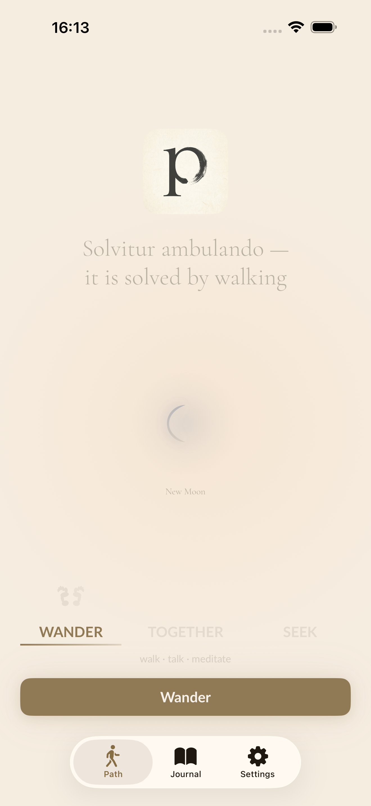
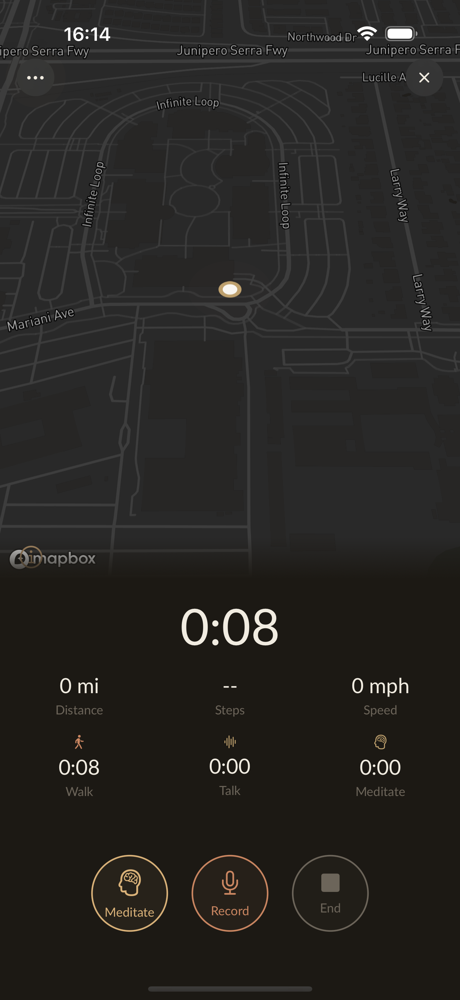
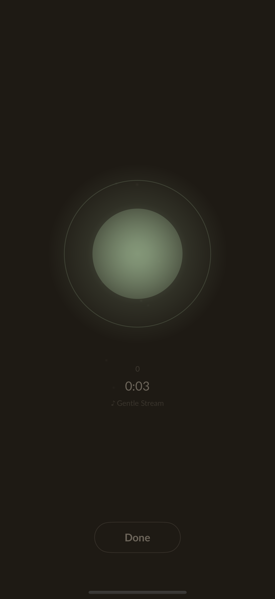
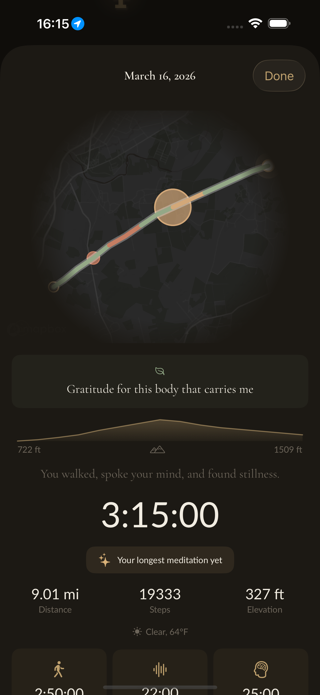
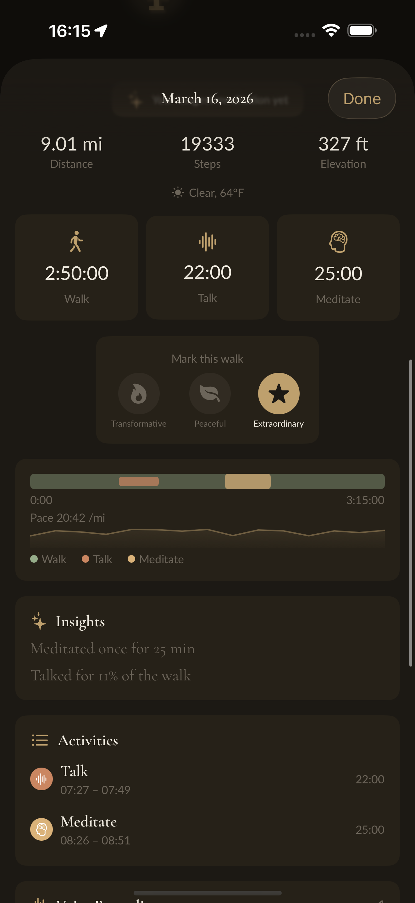
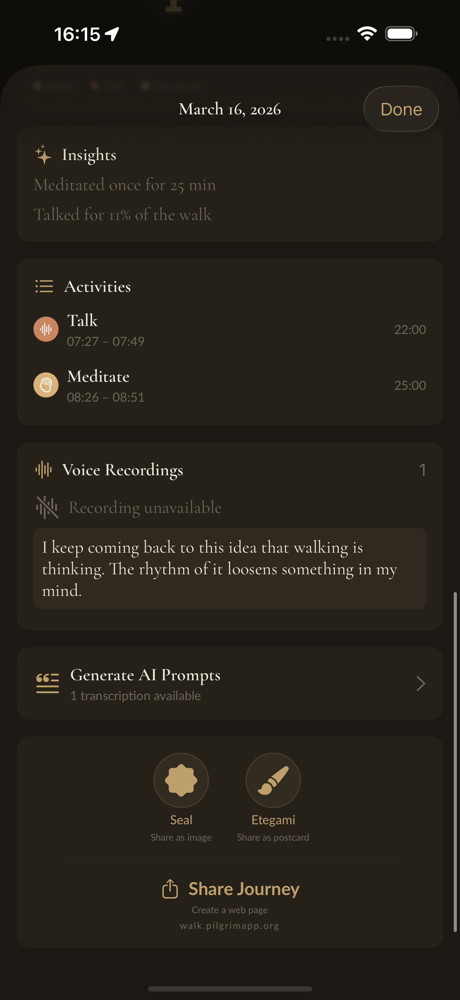
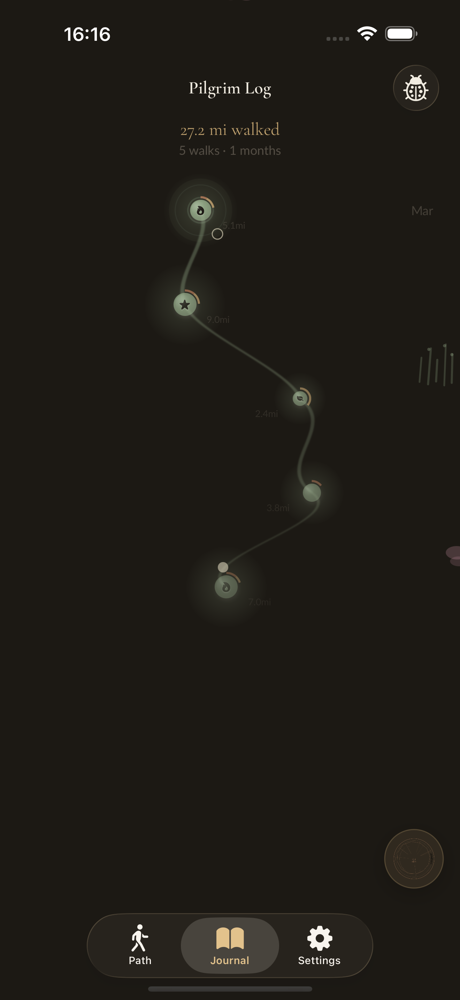
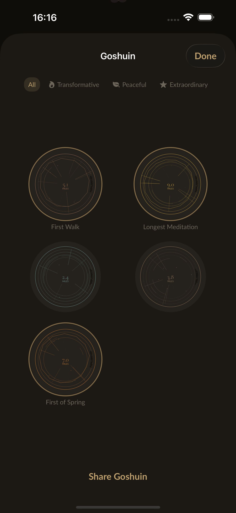
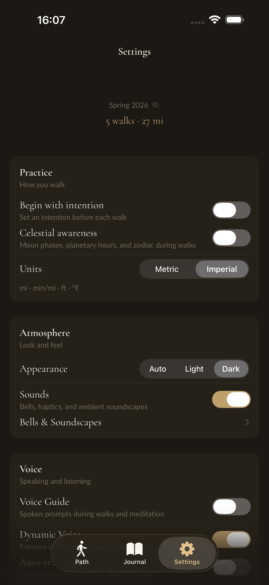

> *The road is made by walking.*
> — Antonio Machado

# Pilgrim

A pilgrimage app for iOS. Track your walks, capture voice reflections, sit in meditation. No accounts. No servers. No leaderboards. Everything stays on your device.

[pilgrimapp.org](https://pilgrimapp.org)

---

<table>
<tr>
<td></td>
<td></td>
<td></td>
</tr>
<tr>
<td></td>
<td></td>
<td></td>
</tr>
<tr>
<td></td>
<td></td>
<td></td>
</tr>
</table>

App Store previews are in [`docs/previews/`](docs/previews/).

---

## What Pilgrim Is

Walking is thinking. It always has been. Aristotle walked while he taught. Wordsworth composed poems on foot. Matsuo Bashō walked the narrow road to the deep north and came back with haiku.

Pilgrim treats a walk as a creative practice — a moving meditation, a thinking space, a way of being in the world. The app holds your walk lightly: GPS route, pace, steps, elevation. It records your voice so you can speak thoughts without stopping. It offers a breathing circle when you want to pause and be still. When you return, it offers back what you gave it: a map of where you went, a transcript of what you said, writing prompts drawn from your own words.

That's the whole thing. No more, no less.

### What Pilgrim Is Not

- Not a fitness app. There are no calorie counters, no personal bests, no badges for streaks.
- Not a social platform. There is no feed, no following, no comparison.
- Not a data business. No analytics, no advertising, no behavioral profiling.
- Not a subscription. No paywall mid-walk, no features gated behind recurring payments.
- Not a cloud service. Your walks live on your phone. When you delete the app, they're gone with it — unless you exported them first.

---

## Features

**The walk itself**

GPS tracking with live pace sparkline, step counting, altitude gain, and waypoint marking. Three-way time breakdown shows how each walk split between walking, talking, and meditating — because those are genuinely different states of attention. Walk data is auto-saved periodically so nothing is lost if the app is interrupted.

**Voice**

Tap to record a voice note at any moment on the walk. Each recording is timestamped and pinned to a location. After the walk, WhisperKit transcribes everything on-device — no audio is ever sent to a server. Auto-transcription runs after each walk when enabled, and skips gracefully when battery is below 20%. The transcriptions become the raw material for writing prompts.

**Meditation**

A dedicated meditation mode with an animated breathing circle. Set the rhythm (inhale, hold, exhale, rest). Meditation time is tracked separately and shown alongside walk time in the summary.

**Voice guides**

Downloadable meditation guide packs with spoken prompts during walks and meditation. Ambient soundscapes — forest, rain, ocean — play in the background. Customizable bells mark the start and end of walks and meditation sessions.

**AI writing prompts**

Six prompt styles — contemplative, reflective, creative, gratitude, philosophical, journaling — generated from your transcriptions and walk context. Copy them into your favorite AI and turn a walk into writing.

**Celestial awareness**

The current moon phase, zodiac sign, and planetary hour appear in the walk context. Not because Pilgrim tells you what they mean, but because awareness of where you are in time is part of where you are in the world.

**Weather**

Live weather via WeatherKit. Conditions are logged with the walk.

**Goshuin seals**

In Japan, pilgrims collect *goshuin* — vermilion ink stamps given at temples along a route. Pilgrim generates a digital seal for each walk, derived from its unique data: distance, duration, weather, elevation. The collection grows with your practice.

**Sharing**

Share a walk as a goshuin seal image, a hand-painted etegami postcard, or an ephemeral HTML walk page (no login required). The walk is yours to keep or share as you see fit.

**Seasonal design**

Colors shift with the seasons, calibrated to your hemisphere. The app looks different in November than it does in May.

**Data portability**

Export as `.pilgrim` packages (full data, importable) or GPX (route only, compatible with any mapping tool).

---

## Privacy

Every feature that could require a network call has been built to work without one.

- Transcription: on-device via WhisperKit
- Writing prompts: generated on-device from walk context, copy into your own AI
- Maps: Mapbox with no user-identifying requests
- Weather: Apple WeatherKit (no personal account linked)
- Walk data: stored in CoreData on the device
- Collective counter: opt-in, sends only anonymous totals (walk count, distance, meditation time)

There is no backend that knows who you are. There is no account to create. The app ships with a full privacy manifest declaring every API it uses and why.

---

## Building

### Requirements

- Xcode 16 or later
- iOS 18.0 deployment target
- CocoaPods (`gem install cocoapods` if needed)
- A physical device or M-series simulator for arm64 builds

### Setup

```bash
git clone https://github.com/momentmaker/pilgrim-ios.git
cd pilgrim-ios
pod install
```

Copy the secrets template and fill in your Mapbox token:

```bash
cp Secrets.xcconfig.example Secrets.xcconfig
# Edit Secrets.xcconfig and add your Mapbox public token
```

Then open the workspace — not the project file:

```bash
open Pilgrim.xcworkspace
```

Build and run on a simulator or connected device. The app functions without a Mapbox token (maps will not render), but all other features work.

### Running Tests

```bash
xcodebuild test \
  -workspace Pilgrim.xcworkspace \
  -scheme Pilgrim \
  -sdk iphonesimulator \
  -destination 'platform=iOS Simulator,name=iPhone 17 Pro'
```

### Generating Screenshots

The `ScreenshotTests` UI test target produces the App Store screenshots using reproducible GPX routes (Camino de Santiago and Shikoku Pilgrimage). Run with `--demo-mode` to trigger the deterministic demo data path.

### Releasing

```bash
scripts/release.sh check     # validate the project is ready
scripts/release.sh bump      # auto-increment build number
scripts/release.sh archive   # build the release archive
scripts/release.sh export    # export for App Store upload
scripts/release.sh upload    # upload to App Store Connect
```

---

## Architecture

### Technology

- **SwiftUI + Combine** — views and reactive state throughout
- **CoreStore** — CoreData ORM with type-safe migrations
- **WhisperKit** (SPM) — on-device speech recognition
- **CocoaPods** — Cache, CombineExt, CoreGPX, ZIPFoundation
- **WeatherKit** — weather data with no user account

### Structure

```
Pilgrim/
├── Scenes/
│   ├── Home/           — journal scroll view, walk list, ink path renderer
│   ├── ActiveWalk/     — live walk, meditation mode, waypoints, intention
│   ├── WalkSummary/    — route map, elevation, timeline, AI prompts, share
│   ├── Goshuin/        — seal collection and generative art renderer
│   ├── Settings/       — preferences, data export, voice guides, sounds
│   └── WalkShare/      — ephemeral HTML walk page generation
├── Models/
│   ├── Walk/
│   │   ├── WalkBuilder/           — coordinates all recording components
│   │   └── WalkBuilder/Components/
│   │       ├── LocationManagement
│   │       ├── VoiceRecordingManagement
│   │       ├── AltitudeManagement
│   │       ├── StepCounter
│   │       ├── LiveStats
│   │       ├── AutoPauseDetection
│   │       └── MeditateDetection
│   └── Data/
│       ├── DataModels/Versions/   — 11-version CoreStore migration chain
│       └── PilgrimPackage/        — .pilgrim export/import format
└── Views/                         — shared components, design system
```

### Navigation

Coordinator pattern: `RootCoordinatorView` manages top-level state, `SetupCoordinatorView` handles first-run permissions. MVVM with `@Published`/`@ObservedObject` throughout.

### Data Model

Pilgrim carries a migration chain from its origin as OutRun through six Pilgrim-specific versions:

```
OutRunV1 → OutRunV2 → OutRunV3 → OutRunV3to4 → OutRunV4
→ PilgrimV1 → PilgrimV2 → PilgrimV3 → PilgrimV4 → PilgrimV5 → PilgrimV6
```

The CoreStore entity names (`OutRunV1`–`V4`, `PilgrimV1`) and migration identifiers are frozen — they cannot be renamed without breaking upgrades for existing users.

### Design System

Typography uses Cormorant Garamond (display, headings, body) and Lato (timer, stats, captions) via `Constants.Typography.*`. Never use `.system()` fonts or SwiftUI defaults.

Colors: stone (accent), ink, parchment, moss, rust, fog, dawn. Seasonal vignettes shift the palette across spring, summer, autumn, winter.

Spacing: `Constants.UI.Padding.*` — xs (4), small (8), normal (16), big (24), breathingRoom (64).

---

## Contributing

Pilgrim is open source under GPLv3. Contributions are welcome.

The app is built for long walks — sessions that last 30, 60, 90 minutes without interruption. The highest obligation when contributing is to not break that. A memory leak that manifests after 45 minutes, an audio player that doesn't clean up after itself, an animation that causes infinite re-diffing — these are not minor bugs. They are the app failing at the moment it matters most.

Before contributing:

- Read the resource safety guidelines in `.claude/CLAUDE.md`
- Study 2–3 existing scenes before writing a new one — patterns exist for a reason
- Timers, audio players, Combine subscriptions, and location updates all require explicit cleanup paths
- Code should be self-documenting; comments that explain *what* the code does signal a refactor, not a note

Open an issue before starting significant work. Not for permission — for conversation. Some paths have been tried and abandoned for reasons that aren't obvious in the code.

---

## Origin

Pilgrim is a fork of [OutRun](https://github.com/timfraedrich/OutRun) by Tim Fraedrich, a workout tracking app published under GPLv3. The core GPS recording infrastructure, CoreData model, and migration chain originate there. Everything built on top — the pilgrimage framing, voice recording, on-device transcription, meditation mode, celestial awareness, goshuin seals, the wabi-sabi design — is new work by the [Walk Talk Meditate](https://github.com/momentmaker/walktalkmeditate) contributors.

---

## License

GNU General Public License v3. See `LICENSE`.

    Pilgrim
    Copyright (C) 2020 Tim Fraedrich <timfraedrich@icloud.com>
    Copyright (C) 2025–2026 Walk Talk Meditate contributors

    This program is free software: you can redistribute it and/or modify
    it under the terms of the GNU General Public License as published by
    the Free Software Foundation, either version 3 of the License, or
    (at your option) any later version.

---

[pilgrimapp.org](https://pilgrimapp.org)
