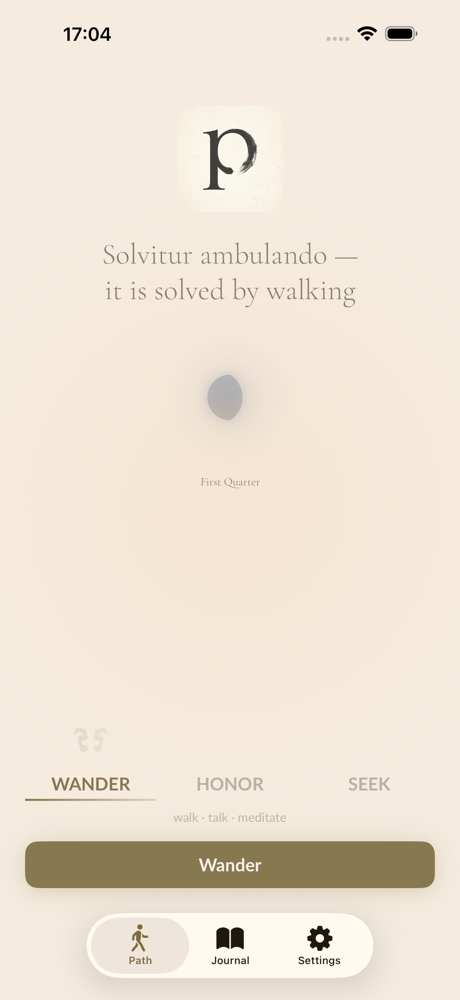
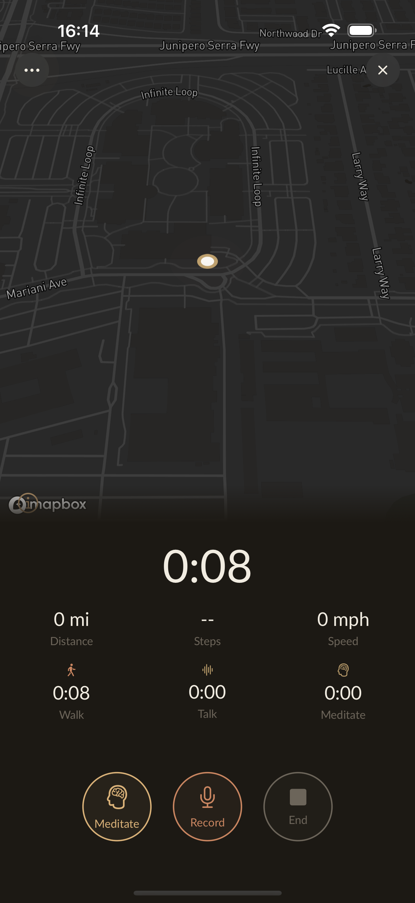
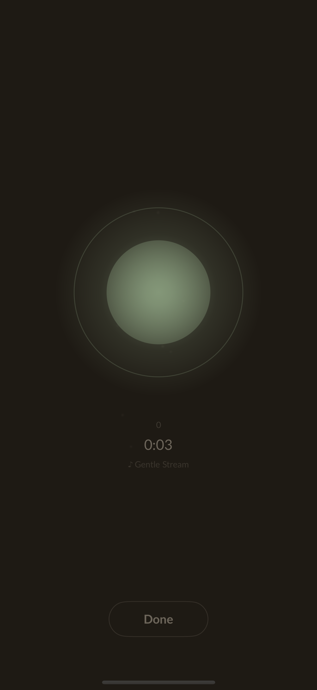
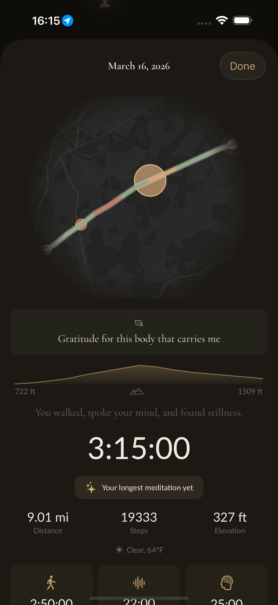
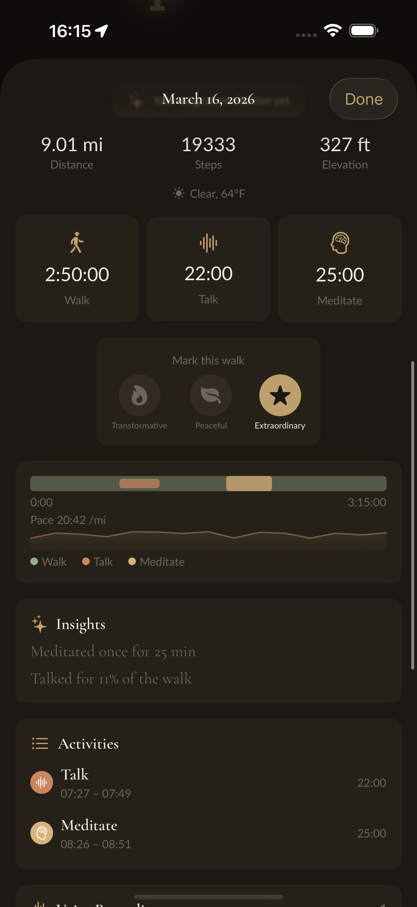
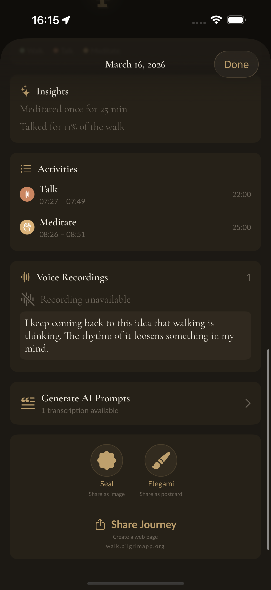
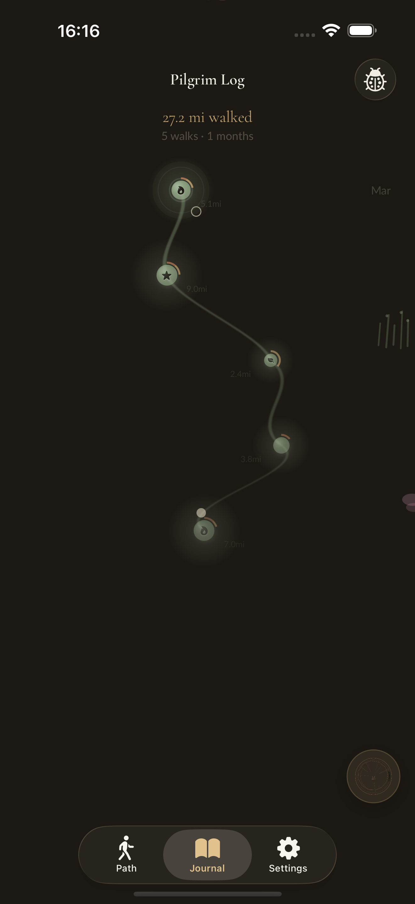
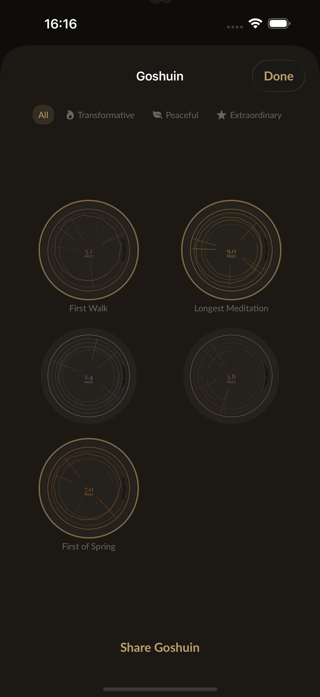
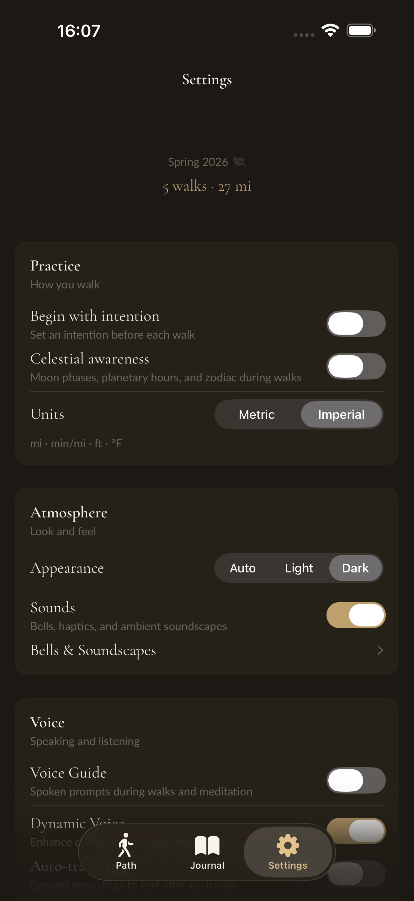

> *The road is made by walking.*
> — Antonio Machado

# Pilgrim

A pilgrimage app for iOS. Walk three ways: wander, seek the unknown, or honor a path someone else laid down. Capture voice reflections, sit in meditation. No accounts. No leaderboards. Your walks stay on your device.

[pilgrimapp.org](https://pilgrimapp.org)

---

<table>
<tr>
<td></td>
<td></td>
<td></td>
</tr>
<tr>
<td></td>
<td></td>
<td></td>
</tr>
<tr>
<td></td>
<td></td>
<td></td>
</tr>
</table>

---

## What Pilgrim Is

Walking is thinking. It always has been. Aristotle walked while he taught. Wordsworth composed poems on foot. Matsuo Bashō walked the narrow road to the deep north and came back with haiku.

Pilgrim treats a walk as a creative practice — a moving meditation, a thinking space, a way of being in the world. The app holds your walk lightly: GPS route, pace, steps, elevation. It records your voice so you can speak thoughts without stopping. It offers a breathing circle when you want to pause and be still. When you return, it offers back what you gave it: a map of where you went, a transcript of what you said, writing prompts drawn from your own words.

That's the whole thing. No more, no less.

### What Pilgrim Is Not

- Not a fitness app. There are no calorie counters, no personal bests, no badges for streaks.
- Not a social platform. There is no feed, no following, no comparison.
- Not a data business. No analytics, no advertising, no behavioral profiling.
- Not a subscription. No paywall mid-walk, no features gated behind recurring payments.
- Not a cloud service. Your walks live on your phone. When you delete the app, they're gone with it — unless you exported them first.

---

## Features

**The walk itself**

GPS tracking with live pace sparkline, step counting, altitude gain, and waypoint marking. The map takes the full screen; the stats collapse into a quiet bar that keeps your intention in view. Three-way time breakdown shows how each walk split between walking, talking, and meditating — because those are genuinely different states of attention. Lock the screen and a Live Activity keeps the walk on your lock screen and in the Dynamic Island. Walk data is auto-saved periodically so nothing is lost if the app is interrupted. Live weather via WeatherKit is logged with each walk.

**Three ways to walk**

*Wander* has no aim: walk, talk, meditate. *Seek* follows the unknown. *Honor* follows a path someone else laid down.

**Seek**

Pick a duration and Seek shapes a one-way journey to fit it, then hides clearings in fog around you. They aren't random and aren't chosen: they grow from a one-way seed of your intention exactly as you typed it, the moment you set out, the ground you stood on, and a throw of entropy, so nothing about you can be read back out of it. As you near one, a sonar ping quickens, the haptic pulse rises, and a crescent of light on your position leans toward the hidden place. The Live Activity carries the distance and bearing. Reach the fog and be still, and the way continues. Found places return on the summary map as halos in the light of the hour you reached them.

**Honor**

Follow a Way: the line another walk laid down, drawn faint beneath your own.

- *A walk someone shared.* Open a walk.pilgrimapp.org link and walk the same ground, a faint companion keeping the sharer's pace beside you. Their voices arrive where they were spoken, their photos wait where they were taken, and you can answer them in the same place. Your answers stay on your phone.
- *Your own walk, again.* Walk one of your own walks a second time and meet what you said the first time, at the spot you said it.
- *A pilgrimage, a stage at a time.* The Camino de Santiago, the Kumano Kodō, and Shikoku's eighty-eight temples, downloaded from the open [open-pilgrimages](https://github.com/walktalkmeditate/open-pilgrimages) dataset. Each morning a stage opens with its own words, its distance, and its climb; at its end it closes with a line you can answer. Water announces itself a few hundred metres ahead, at most once an hour. Shelter, food, and a way out sit on the map as quiet pins that appear only when you zoom in close. On Shikoku, a temple ahead says once that its stamp office shuts at five, while there is still time to decide.
- *Maps with no signal.* Save the maps for a pilgrimage before you go and every stage renders with no reception at all: paths, water, place names, and contours. The route page says how much it will take before you tap. Settings → Data → Maps shows and removes what's saved.

**Voice**

Tap to record a voice note at any moment on the walk. Each recording is timestamped and pinned to a location. After the walk, WhisperKit transcribes everything on-device — no audio is ever sent to a server. Auto-transcription runs after each walk when enabled, and skips gracefully when battery is below 20%. Edit transcriptions inline to fix what WhisperKit got wrong. The transcriptions become the raw material for writing prompts.

**Meditation**

A dedicated meditation mode with an animated breathing circle. Set the rhythm (inhale, hold, exhale, rest). Meditation time is tracked separately and shown alongside walk time in the summary.

**Voice guides and soundscapes**

Downloadable meditation guide packs with spoken prompts during walks and meditation. Seven ambient soundscapes — forest, rain, ocean, stream, birds, fire, crickets — play seamlessly in the background with crossfade looping. Customizable bells mark the start and end of walks and meditation sessions.

**Whispers and cairns**

Leave a whisper, an ephemeral audio gift, at your location for others to find. Choose from seven energies — presence, lightness, wonder, gratitude, compassion, courage, stillness — and set how long it lingers. Walk within 42 metres of anyone's whisper and it arrives as a quiet pulse. The catalog is served from a live manifest, so new whispers arrive without an app update.

Place a stone to start a cairn, or add one to a cairn left by someone who passed before you. Cairns are permanent and grow through seven tiers, each with its own kanji, from a faint mark to the eternal cairn of 108 stones. Cairns within 108 metres make themselves felt, with a haptic pattern of their own.

**The Walk Reliquary**

Photos you happened to take along a walk appear in a quiet carousel on your walk summary — gathered passively from Apple Photos by time and GPS. Nothing is copied, nothing is uploaded, nothing is stored; the app holds only a reference back to Apple Photos. Long-press a photo and tap the pin to commit it as a relic: it becomes a circular thumbnail anchored to exactly where you stood when you took it. Scroll the carousel and the corresponding map pin glows. Tap a map pin and the carousel scrolls to meet it. Opt-in, default off. Photos without GPS are excluded. Screenshots are filtered out.

**AI writing prompts**

Six prompt styles — contemplative, reflective, creative, gratitude, philosophical, journaling — or one you write yourself, generated from your transcriptions, walk context, and pinned photos. The app reads your photos on-device via the Vision framework — detecting landscapes, text, people, colors — and weaves what it finds into the prompts. All analysis is local. Copy them into your favorite AI and turn a walk into writing.

**Themes across walks**

Pilgrim notices the words you return to without meaning to: when something you spoke of weeks ago surfaces again, how long it has been walking with you, and when you first said it aloud. Recurring themes appear as chips on the intention screen — tap one and it becomes the intention you carry, in your words, never renamed. A few quiet noticings are woven into your prompts — a theme that surfaces near the same stretch of ground, a moon cycle closing — at most three lines, and most walks say nothing at all.

**Goshuin seals**

In Japan, pilgrims collect *goshuin* — vermilion ink stamps given at temples along a route. Pilgrim generates a digital seal for each walk, derived from its unique data: distance, duration, weather, elevation. Milestones mark the seal they fall on: a first walk and every tenth, your longest walk and longest sit, the first walk of a season, a first unknown found and a first Way walked to its end, then each tenth, twenty-fifth, fiftieth, and hundredth of both. Archived walks live on as ghost seals. The collection grows with your practice.

**The journal**

Your walks become an ink path down a scroll, and the landscape along it remembers them. Vermilion gates stand at your first walk and every tenth; weathered stone gates mark the walks where seeking found its thresholds. A seek that found places raises a small cairn and a solitary tree, wearing the sky of the hour it was found. The moon beside a walk shows that night's true phase, lanterns glow only for walks that met the dark, and petals, fireflies, dragonflies, or snow drift through with the season. An honor walk carries two staffs.

**Celestial awareness**

Moon phase, zodiac sign, and planetary hour appear in the walk context. A contemplative koan drawn from the celestial, weather, or seasonal context appears before each walk — a seed for reflection. Share a walk and its summary gives back a light reading: one true sentence about the sky at the moment you set out, from a total lunar eclipse down to a walk that began fourteen minutes before sunrise. On the solstices and equinoxes, walks are quietly marked on the summary, the map, and the seal.

**Sharing**

Share a walk as a goshuin seal image, a hand-painted etegami postcard, or an ephemeral HTML walk page (no login required). Shared pages render on Mapbox's outdoors style with terrain contours and trail markings. Optionally include waypoints and pinned photos — both off by default, per-share opt-in. The walk is yours to keep or share as you see fit.

**Walk with me**

Turn on *Interactive* when sharing and the page becomes a living walk: the camera glides your route across a real map under your walk's true sun and weather, your voice recordings play at the places you spoke them, photographs appear where you took them, and meditations become breathing pools with your own soundscape playing low underneath. Viewers can take the guided walk or replay it minute for minute — *as it happened* — with the walker's own clock. Whoever reaches the end may leave one anonymous stone on the walk's cairn, which grows through the same tiers as the cairns on the trail. Recordings and full-size photos upload only when you choose Interactive, transcripts never leave the device, and pages expire — taking everything with them.

→ **[Walk one yourself](https://walk.pilgrimapp.org/9mYhRL7GWx)** — a real walk, shared from the app.

**Walk with the collective**

Opt-in anonymous counter that tracks total walks, distance, and meditation time across all pilgrims. Your Settings screen shows the collective progress mapped to real pilgrimage routes — from the Kumano Kodo to the Camino de Santiago. Sacred number milestones ring a temple bell. A streak flame tracks consecutive days someone, somewhere, has walked. The logo gently pulses when another pilgrim walked in the last hour.

**Appearance**

Colors shift with the seasons, calibrated to your hemisphere. Constellation mode turns the app starlit: deep indigo paper, drifting points of light, a logo and an app icon of its own. Set it from Settings → Appearance. A Home Screen widget carries a quiet mantra that changes daily.

**Your data**

See all your walks rendered on [view.pilgrimapp.org](https://view.pilgrimapp.org) — right from the app, nothing uploaded. Tend them in a quiet browser editor at [edit.pilgrimapp.org](https://edit.pilgrimapp.org): edit reflections, archive what's done, and bring it all back as a single `.pilgrim` file. Export as `.pilgrim` packages (full data, importable). Export voice recordings separately as a zip. Import on a new device anytime.

---

## Privacy

Pilgrim is anonymous: there are no accounts, and nothing it sends says who you are. Everything you make on a walk lives on your device. The calls it does make are below; the [privacy policy](https://pilgrimapp.org/privacy) has the full account.

- Walk data: stored in CoreData on the device
- Transcription: on-device via WhisperKit; the model downloads once from Hugging Face
- Writing prompts: made on-device; opening them looks up the start and end place names through Apple's geocoder
- Weather: Apple WeatherKit, with the walk's location at its start
- Maps: Mapbox tiles; saved pilgrimage maps render with no network at all
- Whispers and cairns: each walk asks walk.pilgrimapp.org for those near you, sending your location with no ID. Placing one stores its position; whispers expire, cairns are public and permanent
- Honor: a shared walk is fetched by its link from walk.pilgrimapp.org, and pilgrimages come from the public open-pilgrimages dataset on jsDelivr. Your answers to a shared walk stay on your device
- Audio: soundscapes, voice guides, and whispers download from cdn.pilgrimapp.org
- Sharing: a page anyone with the link can open. Route, stats, and weather always; a note, photos, and waypoints if you add them; transcripts never. *Interactive* uploads the recordings and full-size photos you pick and trims 150 m from each end. The server asks Mapbox for a map image and DeepSeek for a haiku from the place, weather, and distance. Pages expire
- Feedback: a Trail Note becomes a public issue in this repository
- Podcast: opt-in and anonymous; submitted recordings are kept for 30 days
- Collective counter: opt-in, sends only totals (walk count, distance, meditation and talk time)

Shares, whispers, stones, feedback, podcast submissions, and the counter carry an anonymous app ID, made on the device and used to limit abuse. There is no backend that knows who you are. There is no account to create. The app ships with a full privacy manifest declaring every API it uses and why.

---

## Building

### Requirements

- Xcode 26 or later
- iOS 18.0 deployment target
- CocoaPods (`gem install cocoapods` if needed)
- A physical device or M-series simulator for arm64 builds

### Setup

```bash
git clone https://github.com/walktalkmeditate/pilgrim-ios.git
cd pilgrim-ios
pod install
```

Copy the secrets template and fill in your Mapbox token:

```bash
cp Secrets.xcconfig.example Secrets.xcconfig
# Edit Secrets.xcconfig and add your Mapbox public token
```

Then open the workspace — not the project file:

```bash
open Pilgrim.xcworkspace
```

Build and run on a simulator or connected device. The app functions without a Mapbox token (maps will not render), but all other features work.

### Running Tests

```bash
xcodebuild test \
  -workspace Pilgrim.xcworkspace \
  -scheme Pilgrim \
  -sdk iphonesimulator \
  -destination 'platform=iOS Simulator,name=iPhone 17 Pro'
```

### Releasing

```bash
scripts/release.sh check       # validate the project is ready
scripts/release.sh bump        # auto-increment build number
scripts/release.sh whatsnew    # create or edit the curated App Store release notes
scripts/release.sh changelog   # generate release notes from git log
scripts/release.sh archive     # build the release archive
scripts/release.sh export      # export for App Store upload
scripts/release.sh upload      # upload to App Store Connect
scripts/release.sh tag 2.0.0   # create the git tag and GitHub Release
scripts/release.sh release     # full pipeline with tagging and GitHub Release
```

---

## Architecture

### Technology

- **SwiftUI + Combine** — views and reactive state throughout
- **CoreStore** — CoreData ORM with type-safe migrations
- **WhisperKit** (SPM) — on-device speech recognition
- **Mapbox Maps** (SPM) — maps, and the offline tile regions saved for pilgrimages
- **CocoaPods** — Cache, CombineExt, CoreGPX, ZIPFoundation
- **WeatherKit** — weather data with no user account

### Structure

```
Pilgrim/
├── Scenes/
│   ├── Home/           — journal scroll view, walk list, ink path renderer
│   ├── ActiveWalk/     — live walk, meditation mode, waypoints, intention, Seek and Honor on the walk
│   ├── Honor/          — Ways, shared-walk import, pilgrimage catalog and routes, stage overview
│   ├── WalkSummary/    — route map, elevation, timeline, AI prompts, share
│   ├── Prompts/        — prompt list and custom prompt styles
│   ├── Goshuin/        — seal collection and generative art renderer
│   ├── Settings/       — preferences, data export, voice guides, sounds, saved maps
│   └── WalkShare/      — ephemeral HTML walk page generation
├── Models/
│   ├── Walk/
│   │   ├── WalkBuilder/           — coordinates all recording components
│   │   └── WalkBuilder/Components/
│   │       ├── LocationManagement
│   │       ├── VoiceRecordingManagement
│   │       ├── AltitudeManagement
│   │       ├── StepCounter
│   │       ├── LiveStats
│   │       ├── AutoPauseDetection
│   │       └── MeditateDetection
│   ├── Honor/                     — Way engine, pilgrimage packages, offline tiles
│   ├── Threads/                   — themes across walks, noticings
│   ├── Whisper/, Cairn/           — whisper catalog, cairn placement and tiers
│   └── Data/
│       ├── DataModels/Versions/   — 12-version CoreStore migration chain
│       └── PilgrimPackage/        — .pilgrim export/import format
└── Views/                         — shared components, design system
```

### Navigation

Coordinator pattern: `RootCoordinatorView` manages top-level state, `SetupCoordinatorView` handles first-run permissions. MVVM with `@Published`/`@ObservedObject` throughout.

### Data Model

Pilgrim carries a migration chain from its origin as OutRun through seven Pilgrim-specific versions:

```
OutRunV1 → OutRunV2 → OutRunV3 → OutRunV3to4 → OutRunV4
→ PilgrimV1 → PilgrimV2 → PilgrimV3 → PilgrimV4 → PilgrimV5 → PilgrimV6 → PilgrimV7
```

The CoreStore entity names (`OutRunV1`–`V4`, `PilgrimV1`) and migration identifiers are frozen — they cannot be renamed without breaking upgrades for existing users.

### Design System

Typography uses Cormorant Garamond (display, headings, body) and Lato (timer, stats, captions) via `Constants.Typography.*`. Never use `.system()` fonts or SwiftUI defaults.

Colors: stone (accent), ink, parchment, moss, rust, fog, dawn. Seasonal vignettes shift the palette across spring, summer, autumn, winter.

Spacing: `Constants.UI.Padding.*` — xs (4), small (8), normal (16), big (24), breathingRoom (64).

---

## Contributing

Pilgrim is open source under GPLv3. Contributions are welcome.

The app is built for long walks — sessions that last 30, 60, 90 minutes without interruption. The highest obligation when contributing is to not break that. A memory leak that manifests after 45 minutes, an audio player that doesn't clean up after itself, an animation that causes infinite re-diffing — these are not minor bugs. They are the app failing at the moment it matters most.

Before contributing:

- Read the resource safety guidelines in `.claude/CLAUDE.md`
- Study 2–3 existing scenes before writing a new one — patterns exist for a reason
- Timers, audio players, Combine subscriptions, and location updates all require explicit cleanup paths
- Code should be self-documenting; comments that explain *what* the code does signal a refactor, not a note

Open an issue before starting significant work. Not for permission — for conversation. Some paths have been tried and abandoned for reasons that aren't obvious in the code.

---

## Origin

Pilgrim is a fork of [OutRun](https://github.com/timfraedrich/OutRun) by Tim Fraedrich, a workout tracking app published under GPLv3. The core GPS recording infrastructure, CoreData model, and migration chain originate there. Everything built on top — the pilgrimage framing, voice recording, on-device transcription, meditation mode, Seek and Honor, whispers and cairns, celestial awareness, goshuin seals, the wabi-sabi design — is new work by the [Walk Talk Meditate](https://github.com/momentmaker/walktalkmeditate) contributors.

---

## License

GNU General Public License v3. See `LICENSE`.

    Pilgrim
    Copyright (C) 2020 Tim Fraedrich <timfraedrich@icloud.com>
    Copyright (C) 2025–2026 Walk Talk Meditate contributors

    This program is free software: you can redistribute it and/or modify
    it under the terms of the GNU General Public License as published by
    the Free Software Foundation, either version 3 of the License, or
    (at your option) any later version.

---

[pilgrimapp.org](https://pilgrimapp.org)
