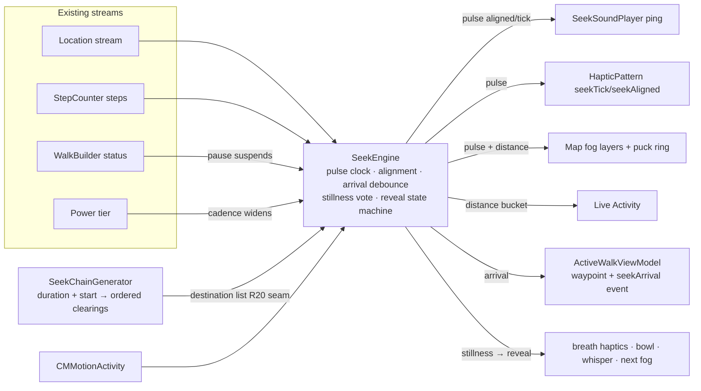

# feat: Seek mode — fogged clearings, pulse guidance, stillness reveals

## Summary

Build Seek as a layer over the existing walk lifecycle: a pure chain generator plus a `SeekEngine` service bound to the existing location stream (mirroring how proximity detection plugs in), a small WalkBuilder addition creating the missing walk-event write path, bundled sonar/bowl audio through the existing `AudioSessionCoordinator`, per-clearing blurred `CircleLayer` fog on the existing map pipeline, and thin extensions to setup flow, options sheet, Live Activity, and summary — all seek UI in new files.

---

## Problem Frame

The home screen has promised Seek ("follow the unknown") since the mode selector shipped; the full product definition lives in the origin requirements doc. Plan-specific framing: the app already contains most of the needed machinery (proximity detection, haptic engine, background audio, Live Activity, waypoints, checkpoint), so this plan is primarily about composing existing seams — the genuinely new surfaces are the chain generator, the pulse/stillness engine, and fog rendering.

---

## Requirements

Origin R-IDs are authoritative (R1–R21 in the origin doc); this plan traces every unit to them. Key clusters:

- R1–R5: setup ritual, duration bands, local randomness (origin: Setup and ritual)
- R6–R7: fogged regions, progressive reveal
- R8–R12: pulse clock, per-context guidance channels, sonar settings, Live Activity
- R13–R17: arrival, signs, stillness reveal, grace, reroll ("Seek anew"), no failure states
- R18–R19: zero-migration persistence, summary extension
- R20: destination-list seam for future pilgrimage mode
- R21: safety framing copy

**Origin flows:** F1 (Begin a seek), F2 (Guidance loop), F3 (Arrival and reveal), F4 (End and summary)
**Origin acceptance examples:** AE1 (R4), AE2 (R9), AE3 (R10, R11), AE4 (R15, R16), AE5 (R1, R17), AE6 (R18), AE7 (R12)

---

## Scope Boundaries

Carried from origin: whole-map fog, Share Your Walk halos, routing/POI/reachability APIs, network randomness, new whisper content, collective features, pilgrimage mode itself, Apple Watch guidance.

Plan-local non-goals:

- No live seek-session resume after crash. Crash recovery salvages walks as finished data for every mode; seek inherits that. Arrivals and the seek marker survive via the checkpoint (user-confirmed deviation from origin R18's first draft; origin updated).
- No changes to `WalkType` raw values — seek walks stay `.walking`; the mode is marked by a walk event (keeps `AutoPauseDetection` inert and avoids "Unknown" rendering in old builds).
- No `NSSupportsLiveActivitiesFrequentUpdates` key — it affects push updates only; local updates at seek cadence need nothing (corrects an origin deferred question).
- No water/land masking at generation time (origin `[Needs research]` item stays open; reroll is the v1 mitigation).

### Deferred to Follow-Up Work

- App Store screenshot refresh featuring Seek: after ship, existing screenshot pipeline.
- Share Your Walk clearing halos: `../pilgrim-worker`, separate repo.

---

## Context & Research

### Relevant Code and Patterns

- `Pilgrim/Models/Proximity/ProximityDetectionService.swift` — location-binding service pattern (5 s throttle, hysteresis); the seam `SeekEngine` mirrors. Wired in `ActiveWalkViewModel.bindProximity()` (~line 451); events handled in `ActiveWalkView.handleProximityEvent` (~line 882) — the exact integration seam for pulse → haptic/audio.
- `Pilgrim/Models/Walk/WalkBuilder/WalkBuilder.swift` — relay + flush pattern (waypoints precedent); **both snapshot paths currently hardcode `workoutEvents: []`** (~lines 393, 425) — the write path U3 adds.
- `Pilgrim/Models/Walk/WalkCheckpoint.swift` + `WalkSessionGuard.swift` — Codable checkpoint at `Application Support/walk_checkpoint.json`; strict `schemaVersion` equality (do NOT bump; arrivals/events ride inside `TempWalk` which already round-trips); checkpoint deleted only after save commit (AF1 — sacred ordering).
- `Pilgrim/Models/Audio/AudioSessionCoordinator.swift` — consumer registry; `.playbackOnly` = `.playback + .mixWithOthers`; existing ids `"soundscape"`, `"bell"`, `"whisper"`, `"voiceRecording"`. `BellPlayer.swift` is the activate-play-deactivate reference.
- `Pilgrim/Models/Audio/AudioPriorityQueue.swift` + `VoiceGuide/VoiceGuideScheduler.swift` — whisper/voice-guide precedence and the 30 s main-runloop timer pattern.
- `Pilgrim/Models/Haptics/HapticManager.swift` — `HapticPattern` enum with CHHaptic builders + UIKit fallbacks; `HapticEngineHost` app-lifetime engine; foreground-only in practice.
- `Pilgrim/Views/PilgrimMapView.swift` (+`+RouteSource.swift`) — dedicated GeoJSON source/layer pattern for the route (fog follows it); render-pause gate with pending-flush; annotation equality early-returns (AF20); `onStyleLoaded` weak-capture rule (AF70). `CircleAnnotation.circleRadius` is **pixels** — fog must be a `CircleLayer` with zoom-interpolated radius, not an annotation.
- `Pilgrim/Scenes/Home/WalkStartView.swift` + `Pilgrim/Scenes/Root/MainCoordinatorView.swift` — mode cards; `startWalk(mode:)` currently **drops the mode**; `ActiveWalkViewModel` takes no mode argument (plumbing U6 adds).
- `Pilgrim/Scenes/ActiveWalk/IntentionSettingView.swift` — reused unchanged; gating at `ActiveWalkView.swift:376` (`beginWithIntention`), bypassed-to-required for seek. `BreathTransitionView` — candidate stillness-moment transition.
- `Pilgrim/Scenes/ActiveWalk/WalkOptionsSheet.swift` — section pattern (Traces/Audio) for the seek section.
- `Pilgrim/Models/Walk/WalkActivityAttributes.swift` + `WalkActivityManager.swift` — ContentState extension point; 1 Hz update call already gated (15 m / flag flip / 15 s); `PilgrimWidget/PilgrimWidgetLiveActivity.swift` (no brand fonts in extension — AF74).
- `Pilgrim/Models/Data/Temp/Versions/TempWaypoint.swift` + `PilgrimV7.Waypoint` (frozen id `"Waypoint"`) — icon is a free SF-symbol string, round-trips `.pilgrim` (`PilgrimPackageConverter.swift:153-167, 404-411`).
- `Pilgrim/Models/Data/DataModels/WalkEvent.swift` — `EventType` Int with `.unknown` fallback for unrecognized raw values; safe to add cases.
- `Pilgrim/Models/ScreenshotDataSeeder.swift` — demo walk struct (needs waypoint/event fields for a demo seek).
- SwiftLint: `type_body_length` error 750, `file_length` error 1000 — `ActiveWalkView.swift` is at ~950 lines; all seek UI lands in new files.

### Institutional Learnings

- Timers: main runloop, `.common` mode (P13), generation counters on `asyncAfter` chains (AF22), owner `deinit` + explicit stop (AF15/16), main-queue delivery on any sink that restarts a timer (AF12).
- Audio: consumer must deactivate in every exit path or the coordinator wedges (AF4-class); `AVAudioPlayer` never auto-resumes after interruption and published state must stay honest (AF5); never stop another player without letting its completion fire (AF6); interruption design follows `docs/solutions/avaudiorecorder-cannot-resume-across-interruption.md` (probe-on-`.ended`), and seek pings must not look like interruptions to an active talk recording.
- Map: fog updates behind the render-pause gate with pending flush; equality early-return before touching sources; `[weak]` in `onStyleLoaded`; incremental math per fix, never O(n) rebuilds (AF9/AF46).
- Power: route any GPS/cadence degradation through `WalkSessionGuard` tiers, never direct `adjustPower` (AF14); pulse cadence widens under `.low`/`.critical`.
- Checkpoint: delete-after-commit ordering preserved; new fields optional; keep payload small (AF13).
- Preferences: `UserPreference.Optional` defaultValue trap — seek prefs use `Required` with defaults since nil is never a valid state here.
- UI: every pulse/fog animation gates on Reduce Motion (RippleEffectView is the house reference); shadows/glows use fixed colors, never adaptive (`.ink` halo bug).

### External References

- Mapbox 11.20.0 (verified against SDK source): `CircleLayer` `circle-blur` for soft edges; radius is pixels → zoom-interpolated expression (exponential base 2, `78271.517·cos(lat)/2^z` m/px); `circleOpacityTransition`/`circleBlurTransition` (`StyleTransition`) give GPU-eased one-shot changes — no animation timers. One layer per clearing (per-feature transitions unverified in gl-native). Paint-property updates are cheap (the puck pulse does them per frame).
- ActivityKit: documented update budget applies to **push** updates only; local `Activity.update(_:)` from a background-location-alive app at 60–120 s is standard practice; `staleDate` as dead-process safety net; iOS 18 mirrors to Watch Smart Stack (budget benign at this cadence).
- AVAudioSession: an active, silent `.playback + .mixWithOthers` session survives gaps between pings — no silent bed (which would burn battery and is an App Review 2.5.4 risk); `duckOthers` explicitly wrong at this cadence (docs: "temporary basis only"); `.playback` ignores the ring/silent switch (desired in-pocket).
- Stillness: CMMotionActivity stationary (5–15 s latency, confidence ramp — absorbed by the 45–90 s window; effectively zero marginal battery, coprocessor already running; `NSMotionUsageDescription` already present); pedometer step-delta zero is the strongest signal; `CLLocation.speed` is jitter-prone — use windowed displacement with accuracy gate instead.

---

## Key Technical Decisions

- **`SeekEngine` is a view-model-level service, not a WalkBuilder component**: mirrors `ProximityDetectionService` (bind to the location stream, publish events). Components are for data that persists into the walk; the engine is session-orchestration. Its destination-list input is the R20 pilgrimage seam.
- **Seek marked via walk event, walks stay `.walking`**: adding a `WalkType` raw value would render "Unknown" in old builds and ripple through display/export; an event is invisible to old builds (`.unknown` fallback) and the summary is the only reader. Requires U3's event write path — which WalkBuilder lacks entirely today.
- **Arrivals = waypoint (reserved SF-symbol icon) + `seekArrival` event**: waypoint gives map/summary/`.pilgrim` round-trip for free; the event carries ordinal semantics. The reserved icon must not collide with the six user-pickable waypoint icons.
- **No checkpoint schema change**: arrivals/events ride `TempWalk` inside the existing checkpoint; no `seekState` field, no `schemaVersion` bump (bumping orphans in-flight walks across an update).
- **Fog = one `CircleLayer` per clearing (max 3), blur + style transitions**: layer-level paint updates transition smoothly; distance-driven opacity written on location ticks with equality early-return; behind the existing render-pause gate.
- **Puck pulse ring = dedicated one-shot CircleLayer via style transitions**, not `Puck2DConfiguration.Pulsing` (fixed 3 s continuous loop, fights the pulse clock). No display links, no repeatForever.
- **Ping audio: idle-active mixable session, no silent bed, no duckOthers**: consumer id `"seekPing"` on `.playbackOnly`; pings *skip* while a whisper/voice guide is playing (behaviorally equivalent to origin R10's "ducking under whispers", simpler and safer than volume choreography).
- **Double-ping/double-pulse = single bundled asset played twice with a generation-guarded gap** — one player per role, no crossfade machinery.
- **Stillness = two-of-three voting**: pedometer step-delta zero over the window (already running) + CMMotionActivity stationary at ≥ medium confidence (new listener) + displacement veto (< ~15 m over the window, accuracy-gated). Variable 45–90 s window; ~4 min grace fallback.
- **Arrival debounce**: N consecutive fixes inside the region with a `horizontalAccuracy` gate before the one-way reveal fires (urban multipath approaches the region radius).
- **Chain shapes**: n=1 out-and-back at ~40–45% of walkable distance; n≥2 loop with final clearing near start (user-confirmed). Count drawn randomly within overlapping duration bands (30 m → 1; 1 h → 1–2; 2 h → 2–3; 3 h → 2–3).
- **Randomness = `SystemRandomNumberGenerator`** (cryptographically secure, local, injectable for deterministic tests) — satisfies origin R5 without ceremony.
- **Zero-arrival seeks render the standard summary** (plus the existing intention card); seek framing appears only when at least one clearing was reached.
- **Seek requires full-accuracy location**: approximate fixes (1–3 km) make the clearing regions physically undetectable, so entry gates on a temporary full-accuracy request with a timeout-bounded GPS hold — a clean gate beats a broken degrade.

---

## Open Questions

### Resolved During Planning

- Stillness signals → two-of-three voting (above).
- Fog rendering → blurred CircleLayers with style transitions (above).
- Live Activity cadence/budget → 60–120 s local updates, ~100 m distance buckets, `staleDate` ≈ now + 3 min; no plist key needed.
- Audio keepalive → idle-active mixable session; no bed, no duck.
- n=1 chain shape → out-and-back (user-confirmed).
- Reroll UI → single "Seek anew" row (user-confirmed, recorded in origin).
- Reduced-accuracy location → hard gate with temporary full-accuracy request (doc-review decision; no viable degrade path).
- Ping/bowl assets → sourced and placed: ping = freesound.org/s/701071 (0.7 s short variant, the full 3.9 s reverb tail cut because it muddies the tightening cadence and the aligned double-ping); bowl = freesound.org/s/150453. Both CC0, so no Settings → About attribution needed.

### Deferred to Implementation

- Alignment cone width (±60° initial) and heading-smoothing window (~15 s initial): on-device tuning against real street grids.
- Cadence curve constants (60 s far → 10 s near) and fog opacity-vs-distance curve: on-device feel tuning.
- Arrival debounce N and accuracy threshold: on-device tuning in urban canyon conditions.
- (none remaining — audio assets resolved; see Resolved During Planning)

---

## High-Level Technical Design

> *This illustrates the intended approach and is directional guidance for review, not implementation specification. The implementing agent should treat it as context, not code to reproduce.*

State machine per clearing: `guiding → arrived (debounced) → stillness-window (or grace) → revealing → next | complete`. Reveal state commits on stillness detection, independent of ritual audio finishing (interruption-safe).

---

## Implementation Units

### U1. SeekChain model and generator

**Goal:** Pure, deterministic-under-test chain generation: clearing count bands, loop/out-and-back geometry, spacing constraints, reroll regeneration.

**Requirements:** R4, R5, R6 (region sizing), R17 (reroll semantics), AE1

**Dependencies:** None

**Files:**
- Create: `Pilgrim/Models/Walk/Seek/SeekChain.swift` (SeekClearing, chain state — Codable)
- Create: `Pilgrim/Models/Walk/Seek/SeekChainGenerator.swift`
- Test: `UnitTests/Seek/SeekChainGeneratorTests.swift`

**Approach:**
- Inputs: duration preset, start coordinate, injected `RandomNumberGenerator` (production: `SystemRandomNumberGenerator`).
- Pace assumption ~24–25 min/mile with ~25% time reserve → walkable distance budget; region radius 80–120 m.
- Count drawn within overlapping bands; n=1 out-and-back at ~40–45% of budget; n≥2 rough loop with final clearing near start; minimum inter-clearing spacing and minimum distance from start.
- `regenerateRemainder(fromActiveIndex:remainingBudget:)` implements R17 reroll under the same constraints.

**Patterns to follow:** pure-model style of `Pilgrim/Models/Walk/MapManagement/PilgrimAnnotation.swift`; turf-swift available for geodesic math.

**Test scenarios:**
- Covers AE1. Happy path: 30-min seek → exactly 1 clearing; 3-hour seek → 2 or 3, never more.
- Happy path: n≥2 chains end within a small radius of start; n=1 clearing lands at ~40–45% of budget.
- Edge case: seeded RNG produces identical chains (determinism harness).
- Edge case: spacing/min-start-distance constraints hold across 1,000 seeded generations at multiple latitudes.
- Happy path: reroll replaces the active clearing and regenerates downstream clearings within the remaining budget, final clearing still near start.
- Edge case: reroll on the final clearing of an n=1 chain yields a fresh reachable-distance clearing, not a degenerate point at the walker's feet.

**Verification:** Generator test suite green; a seeded CLI-style dump of 3 chains eyeballed on a map for sanity.

---

### U2. SeekEngine — pulse, alignment, arrival, stillness, reveal

**Goal:** The session engine: consumes the ordered clearing list, binds to existing streams, and publishes pulse/arrival/reveal/complete events with pause suspension and tier-aware cadence.

**Requirements:** R7, R8, R9 (alignment logic), R13, R15, R16, R17, R20, AE2, AE4

**Dependencies:** U1

**Files:**
- Create: `Pilgrim/Models/Walk/Seek/SeekEngine.swift`
- Create: `Pilgrim/Models/Walk/Seek/SeekStillnessDetector.swift`
- Modify: `Pilgrim/Models/Walk/WalkSessionGuard.swift` (expose the current power tier as a publisher — it is private today with no external announcement; plumbed to the engine via `ActiveWalkViewModel`, which already exposes the guard)
- Test: `UnitTests/Seek/SeekEngineTests.swift`, `UnitTests/Seek/SeekStillnessDetectorTests.swift`

**Approach:**
- Location binding mirrors `ProximityDetectionService.bindToLocation`; all downstream state hops to main.
- Pulse clock: main-runloop timer in `.common` mode; interval = f(distance to active clearing), 60 s far → 10 s near; generation counter invalidates stale fires; cadence floor widens on `.low`/`.critical` tiers (tier injected as a publisher — never touches GPS power directly).
- Alignment: sustained heading from course samples smoothed over ~15 s, generous cone (±60° initial) → pulses carry `aligned: Bool`. Positive-only: misalignment produces plain ticks, never a distinct "wrong" signal.
- Arrival: N consecutive accuracy-gated fixes inside the region → one-way reveal; publishes `arrivedAt(index)`.
- Stillness: two-of-three vote (step-delta zero via injected steps publisher; CMMotionActivity stationary ≥ medium — `[weak self]`, main-confined; displacement veto). Variable 45–90 s window; ~4 min grace fallback fires `revealNext` quietly (AE4).
- Motion & Fitness denied: the detector checks motion authorization at start and switches to displacement-only detection (accuracy-gated displacement < ~15 m sustained over a lengthened window) so the stillness ritual still fires without coprocessor signals.
- Suspension: builder `statusPublisher` pause/resume gates the pulse clock, stillness window, and grace timer (origin R15).
- `deinit` + explicit `stop()`; engine must be torn down on walk end, cancel, and recovery paths.

**Execution note:** Implement the state machine test-first — the reveal/one-way/suspension invariants are exactly the kind of logic that regresses silently.

**Patterns to follow:** `ProximityDetectionService` (binding, hysteresis), `VoiceGuideScheduler` (gated main-runloop timer), `StepCounter.bind` (main-queue delivery), AF12/AF15/AF22 learnings.

**Test scenarios:**
- Covers AE2. Happy path: fixes walking directly away from the clearing (block detour) produce `aligned: false` ticks and no other signal.
- Happy path: cadence shortens monotonically as synthetic fixes approach the clearing.
- Edge case: a single stray fix inside the region does NOT trigger arrival; N consecutive gated fixes do; low-accuracy fixes are ignored.
- Edge case: course flapping while rounding a corner (15 s smoothing) does not flip alignment per fix.
- Covers AE4. Happy path: motion + steps + displacement all still for the window → reveal; only one of three still → no reveal; lingering ~4 min without stillness → grace reveal.
- Edge case: Motion & Fitness authorization denied → displacement-only mode engages; sustained low displacement over the lengthened window still reveals.
- Integration: pause during the stillness window freezes it; resume continues with the same active clearing.
- Happy path: reveal after the last clearing publishes `seekComplete` exactly once; engine goes quiet (no further pulses).
- Edge case: reroll mid-guidance swaps the chain remainder; stale pulse generations no-op.
- Error path: `stop()`/`deinit` cancels the pulse timer and motion updates (no fires after teardown).

**Verification:** Engine suite green; a scripted synthetic-location run (simulator City Run) shows cadence/arrival/reveal behaving end-to-end.

---

### U3. WalkBuilder events channel + persistence primitives

**Goal:** Create the walk-event write path (missing today) and the seek persistence vocabulary: seek-mode marker event, arrival events, reserved arrival waypoint icon.

**Requirements:** R18, AE6

**Dependencies:** None (parallel with U1/U2)

**Files:**
- Modify: `Pilgrim/Models/Walk/WalkBuilder/WalkBuilder.swift` (events relay + flush + inclusion in both `createSnapshot` and `createCheckpointSnapshot`)
- Modify: `Pilgrim/Models/Data/DataModels/WalkEvent.swift` (new `EventType` cases: seek-mode marker, seek arrival)
- Create: `Pilgrim/Models/Walk/Seek/SeekPersistence.swift` (reserved icon constant, arrival-labeling helpers)
- Modify: `Pilgrim/Models/Data/PilgrimPackage/PilgrimPackageConverter.swift` (extend both hand-written event-type string maps — `workoutEventTypeString` and `walkEventType(from:)` — with the new seek cases so export/import round-trips them)
- Test: `UnitTests/Seek/SeekPersistenceTests.swift`

**Approach:**
- Events relay mirrors the waypoints relay/flush pattern exactly (including `registerPreSnapshotFlush` with weak capture — AF8 precedent).
- One seek-mode event written at recording start; one arrival event per reveal. Both snapshot paths must include events or checkpoints silently drop them.
- Reserved arrival icon is an SF-symbol string distinct from the six user-pickable waypoint icons; label carries a human-readable ordinal.
- Frozen CoreStore identifiers untouched; `.unknown` fallback covers old builds importing new `.pilgrim` files.

**Patterns to follow:** waypoint relay/flush in `WalkBuilder.swift`; `PilgrimPackageConverter` event/waypoint round-trip (lines ~81–103, 153–167, 404–411, 467–475).

**Test scenarios:**
- Happy path: events added during recording appear in both the final snapshot and the checkpoint snapshot.
- Covers AE6. Integration: saving a seek walk on a store with existing walks adds waypoints + events only; older walks decode untouched; no migration path executes.
- Happy path: `.pilgrim` export → import round-trips seek events and the reserved waypoint icon.
- Edge case: unknown event raw values decode to `.unknown` (old-build simulation).
- Error path: checkpoint decode of a pre-seek checkpoint file (no events) still succeeds.

**Verification:** Persistence suite green; manual: crash-kill mid-seek in simulator → recovered walk contains arrival waypoints and seek events.

---

### U4. Sonar audio + haptic vocabulary

**Goal:** The pocket channel (bundled ping through a dedicated audio consumer) and the in-hand haptic vocabulary (tick, aligned double-pulse, arrival, breath rhythm), plus seek preferences.

**Requirements:** R9 (haptic characters), R10, R11 (prefs storage), R15 (bowl + breath), AE3

**Dependencies:** None (assets arrive from the freesound.org session; code lands with placeholder assets)

**Files:**
- Create: `Pilgrim/Models/Audio/SeekSoundPlayer.swift`
- Modify: `Pilgrim/Models/Haptics/HapticManager.swift` (new `HapticPattern` cases)
- Modify: `Pilgrim/Models/Preferences/UserPreferences.swift` (`seekSonarEnabled` Required\<Bool\> default true; `seekSonarVolume` Required\<Double\> quiet-leaning default; `seekLastDurationMinutes` Required\<Int\>; `seekSafetyShown` Required\<Bool\> default false — U6's first-seek caption reads and sets it)
- Add: bundled `seek-ping.aac` and `seek-bowl.aac` (already sourced, processed, and placed in `Pilgrim/Support Files/`; this unit's remaining audio work is adding them to the app target's resource build phase). Sources (both CC0, no attribution): ping = freesound.org/s/701071 (8bitmyketison, water drop, trimmed to a 0.7 s short variant); bowl = freesound.org/s/150453 (caiogracco, crystal bowl F3). Both normalized to mono 44.1 kHz AAC.
- Test: `UnitTests/Seek/SeekSoundPlayerTests.swift`

**Approach:**
- Coordinator consumer id `"seekPing"` on `.playbackOnly`; activate at seek start, deactivate on every exit path and `deinit` (AF4 class). Never a mic-capable mode; never `duckOthers`.
- One `AVAudioPlayer` per role; `prepareToPlay()` before each ping; double-ping = second play after a short generation-guarded gap.
- Skip pings while whisper or voice guide is playing (query their published state); never stop another player.
- Interruption handling: on `.ended`, re-arm; keep published state honest on `.began` (AF5). Pings must not perturb an active talk recording's session mode.
- Bowl tone plays at reveal and at seek completion; reveal ritual state is committed by the engine before any audio starts.
- Haptic cases follow the house pattern (CHHaptic builder + UIKit fallback); breath rhythm is a slow soft repeating pattern used only during an in-hand stillness window, cancelled on window exit.

**Patterns to follow:** `BellPlayer` (activate-play-deactivate), `SoundscapePlayer` error-path state resets, `HapticPattern.stonePlaced(tier:)` (associated-value case precedent).

**Test scenarios:**
- Covers AE3 (logic half). Happy path: ping requests while whisper-playing flag is set are skipped; requests after it clears play.
- Happy path: toggling `seekSonarEnabled` off silences ping requests immediately; volume pref applied on next ping.
- Error path: player-init failure resets state and deactivates the consumer.
- Error path: interruption `.began` mid-ping → state honest; `.ended` → next pulse plays without manual intervention.
- Edge case: double-ping generation guard — a cadence change between the two plays cancels the second cleanly.

**Verification:** Suite green; on-device: pings audible with screen locked, under a soundscape, and while Spotify plays (mixed, not ducked); AE3 walked end-to-end.

---

### U5. Map fog + puck pulse ring

**Goal:** Per-clearing fog circles with distance-driven thinning and dissolve-on-arrival; persistent halos for revealed clearings; one-shot pulse ring from the puck.

**Requirements:** R6, R7, R9 (visual pulse), R17 (post-seek map state)

**Dependencies:** U2 (event/state shape)

**Files:**
- Create: `Pilgrim/Views/PilgrimMapView+SeekFog.swift`
- Modify: `Pilgrim/Views/PilgrimMapView.swift` (fog/pulse inputs, coordinator diffing)
- Test: `UnitTests/Seek/SeekFogStateTests.swift` (pure fog-state/diffing model only)

**Approach:**
- One `CircleLayer` per clearing (max 3): `circle-blur` for the soft edge, `circle-pitch-alignment: map`, zoom-interpolated radius expression (exponential base 2) so the region stays geographically sized; `StyleTransition` (~1.5 s) on opacity/blur so location-driven updates ease. Under Reduce Motion, transition durations drop to 0 (instant changes; the distance-conveying opacity delta still communicates proximity).
- Fog entrance ("condenses", F1/F3): new fog layers are inserted at opacity 0 and immediately written to their distance-derived target, riding the same opacity transition — a visible fade-in with no new machinery.
- Fog opacity derived from distance in coarse buckets; equality early-return keyed on (center, bucket) before any style write (AF20 discipline).
- Installed in `onStyleLoaded` with weak captures (AF70); all writes behind the render-pause gate with pending flush (fog never updates while backgrounded).
- Arrival: opacity → 0 via transition (the dissolve *is* the arrival moment); revealed clearings leave a faint persistent halo layer; after `seekComplete`, halos remain, fog gone, ring stops (origin R17).
- Puck ring: dedicated one-shot CircleLayer — radius small→large + opacity→0 flipped in a single style write, GPU-eased by transitions; fires per pulse only when screen on; gated on Reduce Motion; fixed (non-adaptive) colors.

**Test scenarios:**
- Happy path: fog-state model maps distance buckets to expected opacity steps; equality early-return suppresses redundant writes.
- Edge case: bucket boundary jitter (fix oscillating across a boundary) does not thrash writes (hysteresis on bucket transitions).
- Test expectation for rendering itself: none — Mapbox layer rendering is verified visually on simulator (City Run) and device; the testable state model above covers the logic.

**Verification:** Fog visibly thins on approach and dissolves on entry in a City Run simulation; no fog writes occur while backgrounded (log assertion); Reduce Motion disables the ring.

---

### U6. Mode plumbing + seek setup flow

**Goal:** Carry the selected mode into the walk session; add the duration question and required-intention gating; begin the walk inside the ritual (stillness moment → first fog + first pulse).

**Requirements:** R1, R2, R3, R21 (copy surface), F1

**Dependencies:** U1, U2, U4 (prefs)

**Files:**
- Modify: `Pilgrim/Scenes/Root/MainCoordinatorView.swift` (`startWalk(mode:)` passes mode through)
- Modify: `Pilgrim/Scenes/ActiveWalk/ActiveWalkViewModel.swift` (mode-aware init; owns `SeekEngine` when seeking)
- Create: `Pilgrim/Scenes/ActiveWalk/SeekDurationView.swift` (four presets, last-used preselected, first-seek caption line)
- Modify: `Pilgrim/Scenes/ActiveWalk/ActiveWalkView.swift` (seek gating: duration step → intention required → stillness moment)
- Modify: `Pilgrim/Support Files/Base.lproj/Localizable.strings` (duration/safety strings)
- Test: `UnitTests/Seek/SeekSetupFlowTests.swift` (view-model-level gating logic)

**Approach:**
- Duration asked before intention (origin Key Decision); one question, no other configuration; last choice from `seekLastDurationMinutes`.
- First-seek-only safety caption inside the duration step (origin R21): never-trespass + own-judgment framing; tracked by a one-time preference.
- Intention: for seek, the existing intention sheet is required regardless of `beginWithIntention` (skip affordance hidden in seek context); wander behavior unchanged.
- Stillness moment reuses the existing breath transition; on completion the chain generates from the first accurate fix (engine readiness gate) and fog + first pulse begin.
- Chain generation needs a location before the walk starts moving — generate on GPS lock; if lock is slow, the transition holds gracefully (readiness-gate pattern from WalkBuilder components), bounded by a timeout that returns the walker to setup rather than holding the breath transition forever.
- Seek entry requires full-accuracy location: when `accuracyAuthorization` is reduced, request temporary full accuracy before the duration step (approximate 1–3 km fixes make 80–120 m regions undetectable — there is no degrade path); declining routes back to the home screen with a gentle line, and Wander remains fully available.

**Patterns to follow:** `WalkOptionsSheet` presentation style; `IntentionSettingView` sheet gating at `ActiveWalkView.swift:376`; `Constants.Typography` throughout.

**Test scenarios:**
- Happy path: seek mode + no intention → intention required; wander + `beginWithIntention` off → unchanged (no sheet).
- Happy path: duration presets render with last-used preselected; selection persists to the preference.
- Edge case: first seek shows the safety caption; second seek does not.
- Integration: mode flows from home card tap to view model (seek walk owns an engine; wander walk owns none).

**Verification:** Simulator: full F1 flow lands walking inside the ritual in under a minute; wander flow byte-identical to today.

---

### U7. Active-walk integration + options sheet

**Goal:** Wire engine events to the senses (haptics, sound, fog, ring), record arrivals, and add the seek section to the options sheet (sonar controls + "Seek anew").

**Requirements:** R9, R11, R13, R14, R15, R17, F2, F3, AE5

**Dependencies:** U1–U6

**Files:**
- Create: `Pilgrim/Scenes/ActiveWalk/SeekOverlayViews.swift` (seek-specific chrome, kept out of the 950-line main view)
- Modify: `Pilgrim/Scenes/ActiveWalk/ActiveWalkView.swift` (event wiring at the `handleProximityEvent` seam; minimal lines)
- Modify: `Pilgrim/Scenes/ActiveWalk/ActiveWalkViewModel.swift` (arrival → waypoint + event; reroll action; teardown)
- Modify: `Pilgrim/Scenes/ActiveWalk/WalkOptionsSheet.swift` (seek-only section: sonar toggle + volume, "Seek anew" row)
- Test: `UnitTests/Seek/ActiveWalkSeekTests.swift`

**Approach:**
- Pulse events → `HapticPattern` (screen on) + `SeekSoundPlayer` (always) + ring/fog state vars; arrival → `addWaypoint(reserved icon)` + arrival event + fog dissolve; reveal ritual → breath haptics (foreground) + bowl + one whisper from downloaded categories via the existing `WhisperPlayer`/priority queue (no whisper available → ritual proceeds without it).
- "Seek anew" calls the generator's `regenerateRemainder`; available whenever a clearing is active, including before departure; uncapped. After `seekComplete`, the row renders disabled at reduced opacity and the seek section stays visible (Traces-row precedent) — layout stays stable and the quiet control confirms the seeking is complete.
- After `seekComplete`: engine quiet, walk continues as ordinary walk; End button untouched (AE5).
- Signs marked inside clearings use only existing tools — no new content surfaces (R14 requires no code, only restraint).

**Test scenarios:**
- Happy path: engine arrival event produces exactly one waypoint (reserved icon) + one arrival event.
- Happy path: "Seek anew" swaps the remaining chain; active fog updates; count of arrivals so far unchanged.
- Covers AE5. Integration: after final reveal, no further engine events fire; walk records for 40+ synthetic minutes; End completes the standard save path.
- Edge case: reveal ritual with zero downloaded whispers completes (bowl only).
- Error path: walk cancel mid-seek tears down engine + sound player (no timer/consumer leaks — assert via deinit hooks in tests).

**Verification:** End-to-end simulator seek: pulses, arrival, ritual, reveal, completion, ordinary-walk tail, End → summary shows the seek walk saved.

---

### U8. Live Activity

**Goal:** Lock-screen glance channel: coarse distance with tightening rings and travel-relative direction while moving; distance only when stationary.

**Requirements:** R12, AE7

**Dependencies:** U2, U7

**Files:**
- Modify: `Pilgrim/Models/Walk/WalkActivityAttributes.swift` (ContentState: seek distance bucket, direction hint, seek phase)
- Modify: `Pilgrim/Models/Walk/WalkActivityManager.swift` (seek-aware update gating; staleDate)
- Modify: `PilgrimWidget/PilgrimWidgetLiveActivity.swift` (rings + distance + direction rendering)
- Test: `UnitTests/Seek/SeekLiveActivityTests.swift` (bucket + direction + gating logic)

**Approach:**
- Distance in ~100 m buckets; update pushed on bucket change, phase change, or the existing 15 s floor — well inside local-update practice; `staleDate` ≈ now + 3 min as the dead-process net.
- Direction is relative to course over ground (the widget process has no compass): ahead / left / right / behind, hidden when stationary (AE7).
- Ring visual = static per-bucket asset states (no animation in the widget); system fonts accepted in the extension (AF74).

**Test scenarios:**
- Covers AE7. Happy path: stationary → direction nil, distance present; moving → direction resolves from course-vs-bearing delta.
- Happy path: crossing a bucket boundary triggers an update; jitter within a bucket does not.
- Edge case: seek fields nil for wander walks — widget renders exactly as today (parity assertion).

**Verification:** On-device lock screen shows tightening rings + direction during a seek; wander Live Activity unchanged.

---

### U9. Summary extension

**Goal:** Seek walks read as a story: intention header (exists), clearing halos on the summary map, "unknowns found" note, signs grouped per reached clearing plus "Along the way".

**Requirements:** R19, F4

**Dependencies:** U3

**Files:**
- Create: `Pilgrim/Scenes/WalkSummary/SeekSummarySection.swift`
- Modify: `Pilgrim/Scenes/WalkSummary/WalkSummaryView.swift` (compute-once seek data in init; conditional section swap)
- Test: `UnitTests/Seek/SeekSummaryTests.swift`

**Approach:**
- Seek detection from the seek-mode event; arrivals from reserved-icon waypoints + arrival events; all derived in init (AF17 compute-once pattern).
- Signs grouped to the nearest reached clearing within its radius; everything else → "Along the way"; per-clearing groups replace the flat sign sections for seek walks only.
- Note phrasing counts only reached clearings — no totals, no "X of Y" (origin R19); zero arrivals → standard summary + intention card, no seek framing.
- Summary map reuses the existing annotation pipeline for faint clearing halos.

**Test scenarios:**
- Happy path: two reached clearings with photos at each → two groups + "Along the way" for a mid-route photo.
- Edge case: zero-arrival seek renders the standard summary (no halos, no note).
- Edge case: wander walk rendering byte-identical (regression assertion on section list).
- Happy path: note text for 1 vs 2 vs 3 arrivals never contains a total.

**Verification:** Demo seek walk's summary shows grouped signs and halos; a wander walk summary shows zero visual diff.

---

### U10. Settings, demo seed, strings, ship gate

**Goal:** Sonar row in Sound Settings, demo seek walk for screenshots, remaining strings, and the final availability flip.

**Requirements:** R11, R1 (availability)

**Dependencies:** U1–U9

**Files:**
- Modify: `Pilgrim/Scenes/Settings/SoundSettingsView.swift` (Sonar row: toggle + volume, voice-guide pattern)
- Modify: `Pilgrim/Models/ScreenshotDataSeeder.swift` (waypoint/event fields on the seed struct + one demo seek walk)
- Modify: `Pilgrim/Support Files/Base.lproj/Localizable.strings` (remaining seek strings)
- Modify: `Pilgrim/Models/Walk/WalkMode.swift` (`isAvailable` includes seek — the last change to land)
- Test: `UnitTests/Seek/SeekSettingsTests.swift` (pref round-trip), demo seed assertion

**Approach:**
- The availability flip is deliberately the final commit of the feature branch — everything ships dark until then.
- Demo seek walk gives ScreenshotTests a stable seek summary + active-seek frame.

**Test scenarios:**
- Happy path: sonar toggle/volume round-trip through preferences and reflect in the in-walk section.
- Happy path: demo seed produces a seek-marked walk with arrivals (summary section exercisable in ScreenshotTests).
- Test expectation for the `isAvailable` flip: none — one-line gate covered by U6's integration test once flipped.

**Verification:** Full build + test suite green; `/verify`-style manual pass of F1–F4 on device; wander regression walk clean.

---

## System-Wide Impact

- **Interaction graph:** `ActiveWalkView`'s event seam gains a second producer (SeekEngine alongside ProximityDetectionService) — both fire haptics/audio; the priority rule is pings skip during whisper/voice playback. WalkBuilder gains an events relay consumed by both snapshot paths.
- **Error propagation:** engine teardown must run on end, cancel, *and* recovery; audio consumer deactivation on every path (a wedged coordinator mutes the whole app session).
- **State lifecycle risks:** one-way reveals + GPS multipath (debounced, U2); checkpoint delete-after-commit ordering untouched; orphaned Live Activities already swept at launch.
- **API surface parity:** `.pilgrim` export/import now carries events for seek walks — old builds degrade to `.unknown` gracefully (verified fallback).
- **Integration coverage:** crash-kill mid-seek → recovered walk carries arrivals (U3 manual verification); background fog-write suppression (U5).
- **Unchanged invariants:** wander flow, summary, and Live Activity byte-identical (explicit regression assertions in U6/U8/U9); CoreStore schema and frozen identifiers untouched; walk lifecycle (start/pause/End) identical for all modes.

---

## Risk Analysis & Mitigation

| Risk | Likelihood | Impact | Mitigation |
|------|-----------|--------|------------|
| Battery over 2–3 h (audio session + Live Activity + location) | Med | High | Idle-active session (no silent bed); LA updates bucket-gated; pulse cadence widens under power tiers; measure on-device early (U4/U8 verification) |
| GPS multipath false arrivals (one-way reveals) | Med | Med | N-consecutive accuracy-gated fixes (U2); tune N in urban canyon testing |
| Audio interruption wedges ping player or fights talk recording | Med | Med | Dedicated consumer, deactivate-everywhere, probe-on-`.ended` house pattern; pings skip during recording-sensitive states |
| Fog rendering perf on older devices | Low | Med | Layer-level paint updates only (cheap), equality early-returns, render-pause gate; max 3 layers |
| Clearing lands in water/unwalkable area | Med | Low | Region + uncapped "Seek anew"; safety copy; water masking stays a researched follow-up |
| `ActiveWalkView` lint ceiling (950/1000) | High | Low | All seek UI in new files (U5/U6/U7 file layout) |

---

## Phased Delivery

### Phase A — Engine (U1, U2, U3)
Pure logic + persistence primitives; fully unit-testable before any UI exists.

### Phase B — Senses (U4, U5)
Sound, haptics, fog — each verifiable in isolation on simulator/device.

### Phase C — Experience (U6, U7, U8)
Setup ritual, live wiring, lock screen; first end-to-end walkable seek.

### Phase D — Arrival (U9, U10)
Summary story, settings, demo, ship gate flip.

---

## Documentation / Operational Notes

- Audio assets: done. `seek-ping.aac` and `seek-bowl.aac` are in `Pilgrim/Support Files/` (both CC0 — no attribution obligation). Only remaining audio task is U4 adding them to the app target's resource build phase.
- `NSMotionUsageDescription` already present — U10 owns verifying the wording covers motion-activity use, not just steps.
- Release notes follow the wabi-sabi format (v1.5.0+ pattern); Seek is the headline.
- The origin doc's open water-masking research question stays open — candidate for a follow-up brainstorm.

---

## Sources & References

- **Origin document:** [docs/brainstorms/2026-07-06-seek-mode-requirements.md](../brainstorms/2026-07-06-seek-mode-requirements.md)
- Related code: see Context & Research paths above
- External docs: Mapbox Style Spec (circle-blur, transitions), Mapbox v11 migration guide, Apple ActivityKit "Displaying live data", AVAudioSession category option docs, CMMotionActivity docs
