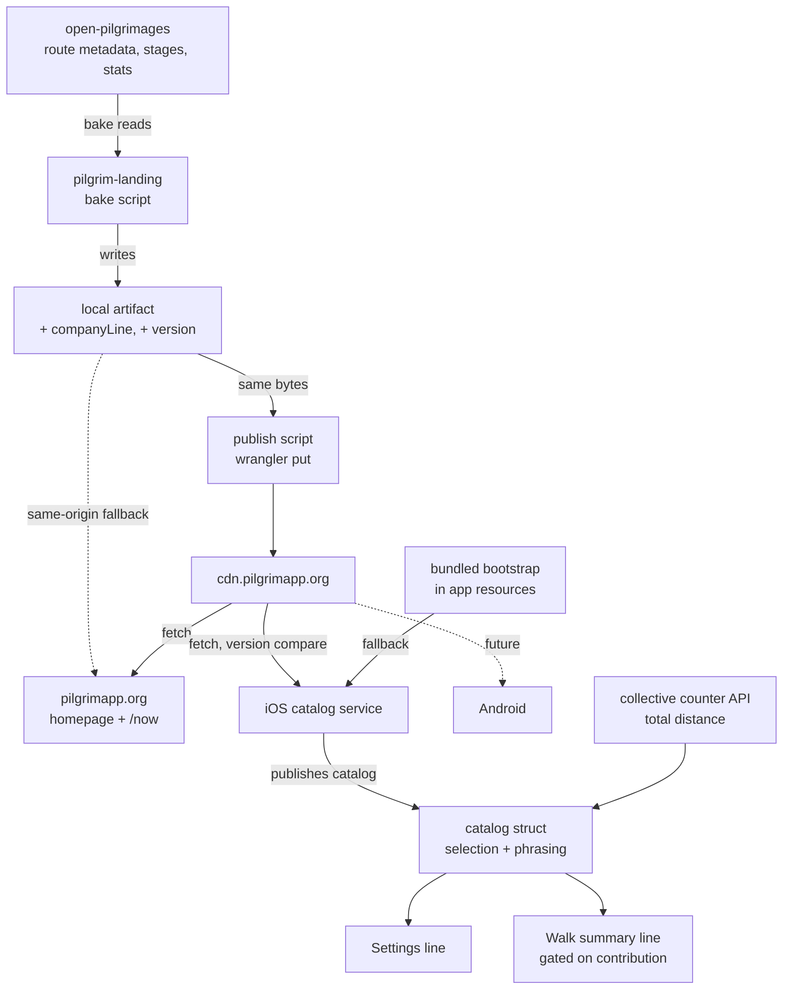
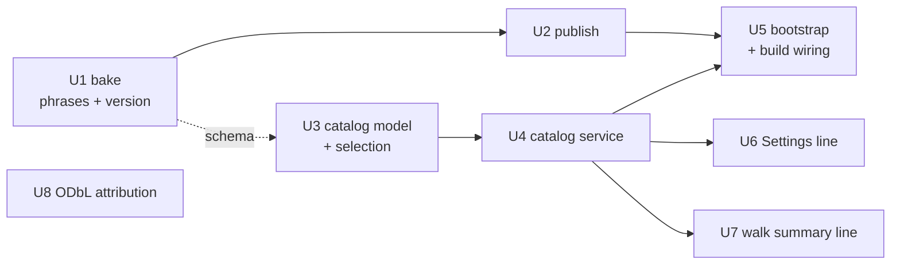

# feat: Daily-rotating collective route lens

## Summary

Port the web's daily route rotation to iOS by mirroring `WhisperManifestService` — cheap init, detached load, bundled bootstrap, lossy decode — with selection and phrasing on the model struct so both are testable without instantiating a service. Settings swaps its line in place; the walk summary gains a new view component. Two units land upstream in `pilgrim-landing` first, because the shared artifact has to exist before anything can read it.

---

## Problem Frame

`Pilgrim/Models/Collective/PilgrimageProgress.swift` is the fourth copy of a hardcoded route table that `pilgrim-landing` already deleted three of. It is wrong (Kumano at 40 km against a real 39; Camino de Santiago at 800 against 764; a "Via Francigena stage" absent from the dataset) and structurally frozen — it selects the largest route the collective has surpassed, so the line climbs and then sits for months.

Full pain narrative and product rationale in the origin document.

---

## Requirements

- R1. Route facts come from a single baked artifact published to the CDN, consumed by web, iOS, and Android.
- R2. Adding, editing, retiring, or reordering a route requires no app release.
- R3. Each entry carries a short display phrase naming who has actually walked it, reflecting that entry's real metric.
- R4. Display phrases contain no distances and no units.
- R5. Entries the app cannot parse are dropped; the remaining catalog still renders.
- R6. A bundled copy of the artifact ships so a fresh install with no network still rotates.
- R7. Exactly one entry is selected per UTC day, identically for every pilgrim.
- R8. Selection is seasonally weighted and scattered so consecutive days do not repeat beyond what the weighting implies.
- R9. Selection runs on-device against cached data with no network available.
- R10. Both surfaces show the same entry on the same day.
- R11. The daily line replaces the hardcoded line in the same Settings position, keeping its single-line shape.
- R12. The walk summary line renders only when the walk was actually contributed.
- R13. The line places the walk's distance against the day's entry and names who has walked it.
- R14. Every entry type produces a line — routes and horizons alike.
- R15. The line coexists with the existing personal distance milestone; both may render.
- R16. Every rendered distance respects the pilgrim's chosen unit.
- R17. ODbL attribution appears in Settings → About → Data Sources.

**Origin actors:** A1 (contributing pilgrim), A2 (non-contributing pilgrim), A3 (route curator)
**Origin flows:** F1 (daily route selection), F2 (walk completion to summary line)
**Origin acceptance examples:** AE1 (covers R12), AE2 (R14), AE3 (R16), AE4 (R6, R9), AE5 (R5), AE6 (R15), AE7 (R10)

---

## Scope Boundaries

- Widget surface, crossings-as-milestones, and the reflection/season texture — deferred in origin, none blocked by this plan.
- Any map, route geometry, or geographic visualization.
- Localization. The app ships English only, which is what makes baked copy viable.
- Refactoring the other four hand-rolled `* 0.621371` conversion sites. Only the two lines this plan touches move to the formatter.
- Promoting `LossyDecodable` to a shared type. The codebase's stated precedent is to duplicate when contracts should not co-move.
- Reconciling `docs/superpowers/specs/2026-03-23-pilgrimage-route-packages-design.md`, which describes a repo and CDN that never shipped.

### Deferred to Follow-Up Work

- Automating the bake in CI: separate work in `pilgrim-landing`. This plan makes the artifact three-consumer, which widens the blast radius of an un-run bake from one surface to three.
- Android port of the selection logic: separate work in `pilgrim-android`. Route data arrives free once the artifact is shared; the selection algorithm still needs its own port.
- Promoting the issue #42 manifest-init learning and the Copy Bundle Resources gap into `docs/solutions/`, which currently holds one entry.

---

## Context & Research

### Relevant Code and Patterns

- `Pilgrim/Models/Whisper/WhisperManifestService.swift` — the reference implementation. The only one of the three manifest services with a bundled-bootstrap seam, and the only one whose init shape encodes the issue #42 post-mortem.
- `Pilgrim/Models/Whisper/WhisperManifest.swift` — `LossyDecodable<T>`, the `static let empty` sentinel, and the stated convention that filter predicates live on the manifest struct rather than the service so tests exercise the same code the service uses.
- `Pilgrim/Models/LightReading/LightReading.swift` — defines its own seeded generator rather than reusing `Pilgrim/Models/SeededRNG.swift`, with documented reasoning that a "same input produces the same output forever" contract must not share an RNG whose algorithm might change. Daily rotation has exactly that contract.
- `Pilgrim/Scenes/WalkSummary/SeekSummarySection.swift` and `PhotoReliquarySection.swift` — the precedent for extracting a walk-summary element into its own view file.
- `scripts/regen-whisper-bootstrap.sh` — the bundled-resource regeneration pattern, including the `xcodeproj` Ruby gem registration block.
- `UnitTests/WhisperManifestServiceTests.swift` and `UnitTests/TurningDayServiceTests.swift` — test structure for injectable services and for pinned UTC calendar dates respectively.
- `UnitTests/Helpers/DateFactory.swift` — `makeDate` builds UTC dates, `makeLocalDate` builds local ones. The split is deliberate.
- `../pilgrim-landing/js/collective-routes.js` — the algorithm being ported, with pinned test vectors in `js/collective-routes.test.js`.

### Institutional Learnings

- **Issue #42 — 880ms launch stall.** The first `.shared` touch of a manifest service used to burn main-thread disk I/O and JSON decode during the welcome entrance. The shipped fix runs all reads in `Task.detached(priority: .utility)` and hops only the publish back to the main actor, passes `service` as a parameter to the load factory rather than capturing a still-mutable `self` inside `init` (a Swift 6 concurrency rule), asserts main-thread on lookups while returning empty until the load lands, and awaits `initialLoad` inside `syncIfNeeded()` so a fast network response cannot clobber the bootstrap decode. Any new launch-path service must copy this shape.
- **Copy Bundle Resources is a manual, forgettable step.** The `Pilgrim` and `UnitTests` targets are not filesystem-synchronized; every new Swift file and resource needs `project.pbxproj` registration. `regen-whisper-bootstrap.sh` registers the audio files it enumerates but not `whispers-bootstrap.json` itself — that entry was hand-added. The team's guard is a runtime `assertionFailure` whose message names the fix.
- **SwiftLint pre-commit only lints staged files.** Whole-type metrics like `type_body_length` pass the hook on a clean diff hunk and fail CI's full-repo run. Run the full lint before pushing.
- **Swift type-check timeouts.** Chained-arithmetic expressions have previously blown the ~3-minute type-check budget in CI. Seasonal weighting math is exactly that shape.
- **App Review re-flags attribution under Guideline 5.2.5** even when it is present and previously approved. v1.7.0 was rejected on the same WeatherKit attribution that passed in v1.6.0. The mitigation that worked was replying with the exact tap path and adding it to App Review Information notes.
- **Nothing publishes to `cdn.pilgrimapp.org`.** No wrangler config exists in any sibling repo for the CDN bucket. Publishing is a manual `wrangler r2 object put` against the `pilgrimapp` bucket with a load-bearing `--remote` flag. Cache status is `DYNAMIC`, so uploads propagate without a purge.

---

## Key Technical Decisions

- **Content-derived version over HTTP ETags**: `GeoCacheService` already does conditional requests in-repo, so ETags were a real option. A version field keeps the new service shaped like its three siblings, and deriving it from content keeps the bake idempotent with no human bump to forget. Computed over the entries payload excluding the version field itself, or it is self-referential.
- **Publish is a separate script from the bake**: the bake is deliberately pure and byte-idempotent. Uploading is a side effect with credentials and a network dependency; keeping it separate preserves the bake's testability.
- **One artifact, one read path**: the bake writes the landing page's local file and the publish script uploads that same file, so the bytes cannot diverge. But the web reads its committed copy same-origin, which means a route edit still needs a git push to reach the site — two independent publication steps, either of which can be forgotten silently. The web therefore reads the CDN copy with its committed file as fallback, so a single publish updates every surface and the "no app release, no web deploy" criterion actually holds.
- **The "who walked it" sentence is baked complete, including its number and the figure's explicit year**: the seven routes do not share a metric, so generic phrasing would be false for two of them. Baking the whole sentence gives the curator control and leaves zero phrasing logic in Swift, at the cost of the number not being locale-formatted by the app. The year is stated rather than implied because the annual figures carry mixed vintages and nothing schedules a re-bake — a relative reference is wrong on the day it ships and rots further every January.
- **Selection and phrasing live on the catalog struct, not the service**: stated convention in `WhisperManifest.swift`, with the rationale that tests should exercise the same predicates the service uses.
- **A dedicated hash port, not `SeededRNG`**: the web's fmix32 scramble is ported verbatim so the Swift implementation can be pinned against the web's existing test vectors, and so a future change to the shared RNG cannot silently reshuffle everyone's day.
- **The walk summary line is its own view component**: `WalkSummaryView` spans 548 of the 750-line `type_body_length` error threshold and the project has never suppressed a lint rule. Only the state and the conditional stay in the parent.
- **`CollectiveMilestone` is extracted before `PilgrimageProgress` is deleted**: they share a file today and are unrelated — one is walk-count milestones, the other the route table. The extraction lands first so the deletion is clean.
- **`isImperial` state and its `UserDefaults.didChangeNotification` observer stay in place**: the formatter reads the preference at call time, which produces a correct string but no view invalidation. Removing the state would leave the line stale until something else redrew Settings.
- **The Settings line gains an explicit truncation contract**: it is currently the only text in that stack without a line limit or scale factor. New phrasing is longer and curator-editable after ship, so the wrap behavior is decided here rather than inherited.

---

## Open Questions

### Resolved During Planning

- **How the artifact reaches the CDN**: a new publish script wrapping the documented `wrangler r2 object put` form. Nothing automated exists in any repo today; this makes the step explicit rather than tribal knowledge.
- **How the app decides its cache is stale**: content-derived version string with a `!=` comparison, matching the sibling services. `!=` rather than `>` so a rollback to a prior artifact also applies.
- **Whether the landing page migrates to the CDN copy**: it does. The bake still writes the local file and the publish script still uploads it, but the web reads the CDN copy with the committed file as fallback. Keeping the web on its same-origin copy would leave two publication steps that can silently disagree, and would break origin's success criterion that a new route reaches all three surfaces without a web deploy.
- **Formatter versus hand-rolled conversion**: route the two lines this plan touches through `Pilgrim/Models/Formatting/CustomMeasurementFormatting.swift` via the `StatsHelper` wrapper, while keeping the existing invalidation observer.

### Deferred to Implementation

- The exact SF Symbol for the collective line. `signpost.right` is the suggestion — a waymarker is the literal visual language of these routes — but it should be eyeballed against the existing `sparkles` milestone.
- Whether the reveal delay reads as a distinct second beat or merely as lag. Tune against the running animation.
- Whether the route bootstrap script shares code with the whisper one or stays a sibling copy. Decide once both are visible side by side.

---

## High-Level Technical Design

> *This illustrates the intended approach and is directional guidance for review, not implementation specification. The implementing agent should treat it as context, not code to reproduce.*



The selection function is pure: given a UTC date, a catalog, and the collective's total distance, it returns the day's entry and its rendered phrases. Nothing about it requires the network, which is what keeps it working on day twelve of a Camino with no signal.

**Unit dependency graph:**



U3 can be developed against a local fixture as soon as U1 fixes the schema; it does not wait for U2. U8 is independent of everything.

---

## Implementation Units

### U1. Bake display phrases and a content version into the shared artifact

**Target repo:** `pilgrim-landing`

**Goal:** Every entry — the seven routes and the three horizons — carries an explicit kind marker and a complete, unit-free sentence naming who has walked it, and the artifact carries a version derived from its own content.

**Requirements:** R1, R2, R3, R4

**Dependencies:** None

**Files:**
- Modify: `scripts/bake-collective-routes.js`
- Modify: `assets/collective-routes.json` (regenerated output)
- Test: `scripts/bake-collective-routes.test.js`

**Approach:**
- Routes compose their sentence from the upstream annual figures, so the number stays in sync with the source rather than being transcribed. The sentence names the figure's explicit year rather than a relative reference — the annual data carries mixed vintages, so "last year" is already false for at least one route on the day it ships and drifts further every January.
- The two routes whose metric is not "completions" need wording that reflects what their number actually counts — foreign overnight visitors for one, an all-modes estimate with a walking-completions breakout for the other.
- Every route entry also gains an explicit kind marker. Only the horizons carry one today, so a Swift entry type keyed on kind would otherwise drop all seven routes.
- Horizons carry hardcoded sentences alongside their existing hardcoded definitions in the bake script.
- The version is computed over the entries payload with the version field excluded, so it is not self-referential and stays stable across identical runs.
- Additive only. The web's existing selection module ignores all three new fields, and its cosmic check is unaffected by a non-cosmic kind value, so `pilgrimapp.org` keeps working untouched.

**Execution note:** Test-first. The unit-free guard is the requirement most likely to rot silently, and it is trivial to assert before the phrases exist.

**Patterns to follow:**
- `scripts/bake-collective-routes.js` — the existing fail-loud and idempotent contract.
- `scripts/bake-daylight-routes` — the sibling bake that established that contract.

**Test scenarios:**
- Happy path: every entry in the baked output has a non-empty company sentence.
- Happy path: a route's sentence contains its upstream annual count, formatted with grouping separators, and names that figure's explicit year.
- Happy path: every route entry carries a kind marker, and the horizons retain the one they already have.
- Edge case: the horizon entries produce sentences despite having no annual data.
- Edge case: re-running the bake on unchanged input produces byte-identical output, including an unchanged version.
- Edge case: changing a route's distance upstream changes the version.
- Error path: no company sentence contains a number immediately followed by a distance unit — this is the guard for R4, and it should fail loudly with the offending entry named.
- Error path: no company sentence contains a relative time reference such as "last year" — same fail-loud shape as the unit guard, since a relative reference silently rots at each year boundary with no app release to catch it.
- Error path: no company sentence exceeds the character budget both surfaces can render at their smallest scale factor — curator edits reach devices without passing through code review, so the budget is enforced where the text is authored.
- Integration: the existing selection module still parses the artifact and returns the same entry for a pinned date as it did before the new fields were added.

**Verification:**
- The regenerated artifact differs from the committed one only by the added fields and the version.
- The landing page renders unchanged against the new artifact.

---

### U2. Publish the artifact to the CDN

**Target repo:** `pilgrim-landing`

**Goal:** A documented, repeatable command that uploads the baked artifact to the CDN, so the apps have a source to read.

**Requirements:** R1, R2

**Dependencies:** U1

**Files:**
- Create: `scripts/publish-collective-routes`
- Modify: `index.html`, `now.html` (read the CDN copy, fall back to the committed file)
- Modify: `README.md` (or the repo's existing script documentation)

**Approach:**
- Thin wrapper over the documented wrangler form used for the whisper manifest, against the same bucket. The `--remote` flag is load-bearing; without it the upload silently targets local storage.
- Refuses to publish when the working artifact differs from a fresh bake, so what ships is always reproducible from source.
- Kept separate from the bake so the bake stays pure, offline-testable, and byte-idempotent.
- Both web pages switch their fetch to the CDN copy, keeping the committed same-origin file as fallback. This is what collapses two publication steps into one — otherwise a route edit reaches the apps on publish but the site only on push, and the two drift with nothing detecting it.

**Patterns to follow:**
- The publish form documented in `docs/superpowers/plans/2026-04-11-dynamic-whisper-catalog.md` (in `pilgrim-ios`) and the whisper publishing reference.

**Test scenarios:**
- Test expectation: none — this is a thin CLI wrapper whose correctness is established by fetching the published URL rather than by unit tests.

**Verification:**
- Fetching the published URL returns bytes identical to the local artifact.
- The response carries the cross-origin headers the web pages need. This matters for the browser, not the app — `URLSession` does not enforce CORS, so a missing header would break the site while leaving iOS working.
- The landing page renders from the CDN copy, and still renders when the CDN is blocked.
- Cache header behavior is confirmed by inspection rather than assumed.

---

### U3. Route catalog model and daily selection

**Goal:** A pure, offline, deterministic selection and phrasing layer that both surfaces read from, testable without instantiating a service.

**Requirements:** R2, R5, R7, R8, R9, R10, R13, R14, R16

**Dependencies:** U1 (schema only — develop against a local fixture)

**Files:**
- Create: `Pilgrim/Models/Collective/CollectiveRoute.swift`
- Create: `Pilgrim/Models/Collective/CollectiveRouteCatalog.swift`
- Test: `UnitTests/CollectiveRouteCatalogTests.swift`

**Approach:**
- The artifact ships routes and horizons as two separate arrays. The catalog decodes each array on its own and concatenates them into one entry type carrying an explicit kind, so selection and phrasing never branch on the absence of a field.
- The catalog owns the selection function and the phrasing, following the stated convention that predicates live on the manifest struct.
- Selection ports the web's algorithm exactly: a date seed built from UTC components, an integer scramble so consecutive dates do not walk contiguous weight runs, and seasonal weighting where the peak bonus is gated behind the in-season bonus.
- The weighted pool is built in an explicit canonical order — routes sorted by identifier ascending, then horizons appended in artifact order. Leaving this implicit would make it agree with the current artifact by coincidence, and R2 permits a curator to reorder routes at any time.
- Phrasing covers all eight branches the web produces, including the two cosmic completion cases. Only the sub-one-percent horizon branch states a raw distance, and that branch is the one that must go through the measurement formatter.
- The contribution phrasing for the walk summary is a second function on the same type, so both surfaces derive from one source and R10 holds by construction.
- Lossy decoding is duplicated locally rather than shared.

**Execution note:** Test-first. The web supplies pinned vectors, so the failing tests can be written before any Swift exists — but port the web's two-route test fixture along with them. The published vectors are properties of that fixture, not of the production catalog; asserting them against the bundled artifact produces red tests that look like a broken port.

**Technical design:** *(directional)*

The weighting is the one piece where a faithful port matters more than idiomatic Swift:

```
weight(entry, month):
    horizons always weigh 1
    routes start at 1
    + in-season bonus when the month is a best month
    + peak bonus ONLY when the month is also a peak month
      (gated — peak is an intensifier, never an independent boost)
```

Break the arithmetic into named intermediate values rather than a single chained expression; chained arithmetic has previously blown the CI type-check budget in this codebase.

**Patterns to follow:**
- `Pilgrim/Models/Whisper/WhisperManifest.swift` — lossy decoding, the empty sentinel, predicates-on-the-struct.
- `Pilgrim/Models/LightReading/LightReading.swift` — a feature-local deterministic generator rather than the shared one.
- `../pilgrim-landing/js/collective-routes.js` — the algorithm and its pinned vectors.

**Test scenarios:**
- Happy path: against the web's two-route test fixture, 7 October 2026 selects the Kumano Kodo, reproducing the published vector exactly. This vector is fixture-bound — the production catalog selects a different route on that date, and asserting it against the bundled artifact is the most likely first failure of this unit.
- Happy path: against that same fixture, twenty-six of October's thirty days select an in-season route, matching the web's distribution assertion. Also fixture-bound; the production catalog yields a lower count because its weighted pool is twice the size.
- Happy path: Covers AE7. Running the Swift selection and the web's module over the same production artifact returns the same entry for every day of a sample month. This, not the fixture vectors, is what proves the two surfaces agree.
- Happy path: the same UTC date returns the same entry across repeated calls.
- Happy path: two timestamps in different local time zones that fall on the same UTC day return the same entry.
- Happy path: shuffling the order of the input arrays does not change the selected entry, so a curator reordering routes cannot desync the surfaces.
- Happy path: collective distance at two or more times a route's length renders the multiple-completions phrasing.
- Happy path: collective distance past a route once renders the single-completion phrasing.
- Happy path: collective distance short of a route renders the percentage phrasing.
- Happy path: a horizon at or above one percent renders the percentage phrasing.
- Happy path: a horizon reached exactly once renders the single-completion phrasing.
- Happy path: a horizon reached two or more times renders the multiple-completions phrasing.
- Happy path: Covers AE3. A horizon below one percent renders the remaining distance, and renders it in miles when the preference is miles.
- Happy path: Covers AE2. A horizon entry produces a contribution line rather than returning nil.
- Happy path: a route entry's contribution line contains both the walk distance and the entry's company sentence.
- Edge case: zero collective distance renders the beginning-of-path phrasing on both surfaces.
- Edge case: Covers AE4. Consecutive UTC days select different entries often enough that the scramble is demonstrably working, not merely deterministic.
- Edge case: a month that is a peak month but not a best month confers no bonus.
- Edge case: an empty catalog returns no entry rather than crashing.
- Edge case: a catalog containing only horizons still selects.
- Error path: Covers AE5. An entry with an unrecognized kind is dropped and every other entry still decodes and selects.
- Error path: an entry missing its distance is dropped without failing the whole catalog.

**Verification:**
- The web's pinned vectors pass unmodified in Swift when run against the fixture they were written for.
- The Swift port and the web module agree entry-for-entry across a sample month of the production artifact.
- Selection and phrasing are exercised with no service, no network, and no file system.

---

### U4. Route catalog service

**Goal:** Fetch, cache, and publish the catalog without adding measurable work to the launch path.

**Requirements:** R1, R2, R6, R9

**Dependencies:** U3

**Files:**
- Create: `Pilgrim/Models/Collective/CollectiveRouteCatalogService.swift`
- Modify: `Pilgrim/Models/Config.swift`
- Modify: `Pilgrim/AppDelegate.swift`
- Test: `UnitTests/CollectiveRouteCatalogServiceTests.swift`

**Approach:**
- Mirror `WhisperManifestService` structurally rather than approximately. The pieces that matter are the cheap convenience init, the injectable designated init taking a directory and a bootstrap-URL closure, the exposed initial-load task, the load factory receiving the service as a parameter rather than capturing it, the main-thread assertion on lookups returning empty before the load lands, and the await on the initial load inside the sync before any version comparison.
- Version comparison is inequality, not greater-than, so a rollback applies.
- The missing-bootstrap path fails loudly in development with a message naming the remedy, and degrades to an empty catalog in release.
- The new endpoint joins the CDN group in the config namespace rather than being hardcoded at the call site, unlike the collective counter's existing base URL.
- Registered at launch alongside the three existing manifest syncs, with the same debug launch-profile mark.

**Execution note:** Test-first for the three-tier load precedence — it is the behavior most likely to regress silently and the hardest to notice by hand.

**Patterns to follow:**
- `Pilgrim/Models/Whisper/WhisperManifestService.swift` — including its comments, which encode the issue #42 post-mortem.
- `UnitTests/WhisperManifestServiceTests.swift` — temp-directory fixtures, injectable init, awaiting the initial load.

**Test scenarios:**
- Happy path: with no cached file, the bundled bootstrap serves the catalog.
- Happy path: with a cached file present, it wins over the bootstrap.
- Happy path: a remote catalog with a different version replaces the cache and publishes.
- Edge case: a remote catalog with an equal version leaves the published catalog untouched.
- Edge case: a remote catalog with an older version still applies, so a rollback recovers.
- Edge case: lookups before the initial load completes return empty without blocking the caller.
- Error path: a corrupt cached file falls back to the bootstrap rather than surfacing an empty catalog.
- Error path: a failed or non-success network response leaves the existing catalog in place.

**Verification:**
- No measurable main-thread work is added at first touch; the launch profile mark lands after the UI is up.
- Both surfaces render correctly when queried before the load completes.

---

### U5. Bundled bootstrap and build wiring

**Goal:** A fresh install with no network renders a line, and the bundled artifact cannot silently go missing.

**Requirements:** R6

**Dependencies:** U2, U4

**Files:**
- Create: `Pilgrim/Support Files/collective-routes-bootstrap.json`
- Create: `scripts/regen-route-bootstrap.sh`
- Modify: `Pilgrim.xcodeproj/project.pbxproj`
- Modify: `scripts/release.sh`

**Approach:**
- The regeneration script pulls the published artifact into the bundle, mirroring the whisper script — and closes the gap that script has by registering the JSON itself with the Xcode project rather than only the assets it enumerates.
- The file must live in the support files group because the group's path is what the registration resolves against.
- A new release command sits alongside the existing whisper bootstrap command and runs in the same position in the pipeline, so any project-file mutation rides along in the version-bump commit.
- The regenerated JSON is staged into that same commit alongside the project file. CI builds from a clean checkout, so a bootstrap left uncommitted in the working tree means every CI-built binary ships whatever stale copy is in git — the committed file, not the freshly pulled one, is what reaches users.
- The registration is the step most likely to be forgotten; U4's loud failure is the safety net, and this unit is what makes the net unnecessary.

**Patterns to follow:**
- `scripts/regen-whisper-bootstrap.sh` — the curl-verify-register shape and its Ruby registration block.
- `scripts/release.sh` — the existing bootstrap command's dispatch entry and its position in the release pipeline.

**Test scenarios:**
- Test expectation: none — this is build tooling. Correctness is established by the clean-install verification below rather than by unit tests.

**Verification:**
- Covers AE4. A clean install on a simulator with networking disabled loads the catalog and rotates to a different entry when the device date advances a day. It renders no line in Settings, because the collective's total is unknown until a fetch has succeeded — the offline guarantee covers which route rotates, not the progress against it. The walk summary's line needs no total and does render offline.
- A build with the bundled file deliberately removed trips the development-time failure with its remedy message.
- The project file diff contains exactly the four expected registration entries and nothing else.

---

### U6. Settings line swap

**Goal:** The Settings header renders the day's entry instead of the frozen table, and the unrelated milestone type survives the deletion intact.

**Requirements:** R10, R11, R16

**Dependencies:** U4, and U5 for manual verification — automated tests inject fixtures, but rendering this surface in a simulator resolves the bundled bootstrap, which does not exist until U5 lands.

**Files:**
- Create: `Pilgrim/Models/Collective/CollectiveMilestone.swift`
- Modify: `Pilgrim/Scenes/Settings/PracticeSummaryHeader.swift`
- Modify: `Pilgrim/Models/Collective/CollectiveCounterService.swift`
- Delete: `Pilgrim/Models/Collective/PilgrimageProgress.swift`
- Test: `UnitTests/CollectiveMilestoneTests.swift`

**Approach:**
- Extract the walk-count milestone type to its own file first, as a pure move with no behavior change, then delete the route table and the computed property that exposed it. Sequencing the extraction first keeps the deletion reviewable as a deletion.
- The header reads the catalog service and renders nothing until the catalog lands, matching how the collective stats block already renders nothing until the counter responds.
- The unit-preference state and its notification observer stay. Only the conversion arithmetic moves to the formatter — the observer is what triggers the re-render, and the formatter does not replace it.
- The line gains a line limit and a scale factor. It is the only text in that stack without them today, and the new phrasing is both longer and editable after ship.

**Patterns to follow:**
- `Pilgrim/Scenes/Settings/PracticeSummaryHeader.swift` — the existing conditional-render shape for the collective stats block, and the sibling line's truncation treatment.
- `Pilgrim/Models/Walk/StatsHelper.swift` — the formatter wrapper, which handles the nil case.

**Test scenarios:**
- Happy path: the walk-count milestone type resolves the same messages after the file move as before it, for each named threshold and for an unnamed number.
- Integration: no reference to the deleted type remains anywhere in the target, verified by a clean build rather than by search.
- Note: the rendered phrasing itself is covered by U3's tests; this unit's risk is the removal and the wiring, not the strings.

**Verification:**
- Settings renders the day's entry, and the entry matches what the web shows for the same UTC date.
- Toggling units in Settings updates the line without leaving the screen.
- The header renders cleanly on a small device and at the largest accessibility text size.

---

### U7. Walk summary collective line

**Goal:** A contributed walk ends with its distance placed against the day's entry, and a non-contributed walk ends with nothing added.

**Requirements:** R10, R12, R13, R14, R15, R16

**Dependencies:** U4, and U5 for manual verification — same reason as U6.

**Files:**
- Create: `Pilgrim/Scenes/WalkSummary/CollectiveTrailSection.swift`
- Modify: `Pilgrim/Scenes/WalkSummary/WalkSummaryView.swift`
- Test: `UnitTests/CollectiveTrailSectionTests.swift`

**Approach:**
- A new view component, not an inline builder. The parent gains only the conditional and its placement; everything else lives in the new file.
- Positioned directly beneath the personal milestone and above the stats row, so the screen reads fact, then your arc, then the larger arc, then details.
- The entry and the progress against it resolve from the walk's own start date, not from today. This screen is presented for any past walk opened from the journal, so anchoring to the current date would mean a walk from last month silently shows a different route every time it is reopened. The personal milestone in the same view already anchors its queries to the walk being viewed.
- The line carries its own explicit line limit and scale factor rather than inheriting the personal milestone's. It is the longest text this feature produces — a walk distance plus a full company sentence — and the milestone's budget was tuned for a much shorter string.
- Visually subordinate to the personal milestone: the same icon-and-caption shape but no background fill, in the accent color the collective already uses everywhere else in the app. Two identically-chromed pills stacked would read as one repeated element rather than two different ideas.
- Participates in the existing reveal phase with a slightly longer delay than the milestone, so it arrives as a second beat. Honors reduced motion like its siblings.
- The render gate is a pure function taking the contribution preference and whether the catalog has loaded, so the decision is unit-testable without a view.

**Patterns to follow:**
- `Pilgrim/Scenes/WalkSummary/SeekSummarySection.swift` — an extracted, conditionally-rendered walk-summary component.
- The existing milestone callout in `WalkSummaryView.swift` — icon-and-caption shape, reveal-phase gating, line limit.

**Test scenarios:**
- Happy path: Covers AE1. With contribution disabled, the gate returns false and nothing renders.
- Happy path: with contribution enabled and a loaded catalog, the gate returns true.
- Edge case: with contribution enabled but no catalog yet, the gate returns false rather than rendering a partial line.
- Edge case: Covers AE6. A walk that crosses a personal milestone and was contributed satisfies both gates independently, so both elements render.
- Edge case: a walk whose start date falls on a different UTC day than today resolves the entry for its own date, not today's.
- Note: the line's content is covered by U3's contribution-phrasing tests; this unit owns the gate, the date anchor, and the placement.

**Verification:**
- A contributed walk shows the line; the same walk with contribution disabled shows nothing and no empty space.
- The line appears after the milestone rather than with it.
- Reopening a walk from the journal on a later day shows the same route and progress it showed when the walk ended.
- The longest phrasing this feature produces — the horizon branch with its trailing clause — renders without truncation on a small device at the largest accessibility text size.
- `WalkSummaryView` stays clear of the type-length error threshold, confirmed by a full-repo lint rather than the staged-files hook.

---

### U8. ODbL attribution

**Goal:** The route dataset is attributed where App Review can find it in one tap path.

**Requirements:** R17

**Dependencies:** None

**Files:**
- Modify: `Pilgrim/Scenes/Settings/AboutView.swift`

**Approach:**
- A prose sentence naming the source and its licence, followed by a link row, matching the existing weather entry's structure exactly.
- No Apple glyph — that is required by Apple's own attribution terms and would be wrong on an open-data source.
- The section's staggered-entrance index is shared with a sibling today, so check the ordering before assigning rather than assuming indices are unique.
- Operationally, the App Review Information notes should gain this tap path alongside the existing weather one. That is not a code change but it belongs to this unit's completion.

**Patterns to follow:**
- The data sources section in `Pilgrim/Scenes/Settings/AboutView.swift` — prose paragraph followed by a link row that opens an in-app browser sheet rather than leaving the app.

**Test scenarios:**
- Test expectation: none — static content with no behavioral change.

**Verification:**
- The attribution is reachable from Settings in the same number of taps as the weather entry.
- The link opens in the in-app browser rather than leaving the app.

---

## System-Wide Impact

- **Interaction graph:** The launch sequence gains a fourth manifest sync. The collective counter service loses a computed property. Both the Settings header and the new walk-summary component observe the catalog service, and both also read the counter service for the collective's total distance.
- **Error propagation:** Fetch failure is silent and keeps whatever catalog is already loaded, matching the established manifest convention. A missing bundled artifact fails loudly in development and degrades to an empty catalog in release, where both surfaces render nothing rather than a placeholder.
- **State lifecycle risks:** The catalog is nil between launch and the completion of the detached load. Every consumer must tolerate that window; neither surface may assume a catalog exists on first frame.
- **API surface parity:** `pilgrim-android` mirrors iOS and inherits the shared artifact without a data port, but still needs its own selection port. Until it lands, Android and iOS will show different routes on the same day.
- **Integration coverage:** Two paths unit tests will not prove — a fresh offline install rendering from the bundled artifact, and the Settings line updating live when units are toggled. Both are in the verification steps of their units.
- **Unchanged invariants:** The walk-count milestone behavior, the collective counter API and its fetch throttle, the contribution gate's effect on whether a walk is counted, and the existing personal walk-summary milestone all keep their current behavior. This plan changes what the collective line *says*, not what the collective *counts*.

---

## Risks & Dependencies

| Risk | Mitigation |
|------|------------|
| A fourth launch-path service reintroduces the issue #42 main-thread stall | Copy the reference service's init and load shape rather than approximating it, including the service-as-parameter factory. Verify with the launch profile marks, not by feel. |
| `WalkSummaryView` crosses the hard lint error threshold | The new line lands in its own file. Run a full-repo lint before pushing; the pre-commit hook only sees staged files and will pass a change that fails CI. |
| The bundled artifact silently fails to ship | The regeneration script registers the JSON itself, closing the gap the whisper script left, and the loud development-time failure names the remedy. |
| A curator writes a distance into a company sentence, which the app cannot convert | The bake asserts no number-followed-by-unit pattern in any sentence and fails with the offending entry named. |
| The manual bake and publish freezes all three surfaces at once | Out of scope here and flagged as follow-up work. The publish script at least makes the step explicit and refuses to ship an artifact that does not match a fresh bake. |
| Seasonal weighting arithmetic blows the CI type-check budget | Named intermediate values rather than a single chained expression, per the existing precedent in this codebase. |
| App Review re-flags attribution under Guideline 5.2.5 | Extend the App Review Information notes with this tap path at the same time as the existing weather one, rather than waiting for a rejection. |
| Android and iOS disagree on the day's route until the Android port lands | Accepted. The artifact is shared from day one, so the divergence is in selection logic only and closes when Android ports it. |

---

## Documentation / Operational Notes

- The publish step is a new manual operation. Document it where the whisper publishing procedure lives so both are found together.
- App Review Information notes need the ODbL tap path added alongside the weather one before the next submission.
- The release pipeline gains a bootstrap step; anyone running a release should expect a project-file change in the version-bump commit.

---

## Deferred / Open Questions

### From 2026-07-18 review

These surfaced during document review as genuine judgment calls rather than defects. Each needs a decision before or during the unit that owns it.

**Fresh-install nil collective distance — coerce to zero, or suppress the line?** *(affects U6, U7, R6, R9, AE4)*

Both surfaces need the collective's total distance to phrase anything, but that value is nil until a network fetch succeeds — exactly the fresh-offline case AE4 describes. The plan traces the catalog-nil window and never this one. Two reviewers proposed opposite fixes. Coercing nil to zero mirrors the web's own handling and keeps AE4 literally true, but renders "the path is beginning" to a user while the collective is several hundred kilometres in — a fabricated number in a feature whose origin decision was never to fabricate one. Suppressing the line until the total is known is truthful but weakens AE4 to cover which route rotates rather than the progress against it. The route rotation itself is genuinely offline-capable either way; only the phrasing depends on the network.

**Is the contribution gate allowed to read the live preference?** *(affects U7, R12)*

R12 says the line renders only when the walk *was actually contributed* — a past-tense fact about one walk. Nothing records that fact today, so the gate would read the current global preference instead. A pilgrim who contributes a walk and later turns the toggle off would see the line vanish from a walk that did move the counter; one who turns it on afterward would see a line claiming a contribution that never happened. Closing this properly means recording the outcome per walk at the moment it is sent. Accepting it means documenting the drift as known behavior and softening R12's wording. The cost is small either way; the question is whether an approximation is acceptable for a claim the origin doc treats as a truthfulness constraint.

**Is the Android divergence window sized honestly, and when does it close?** *(affects Risks & Dependencies, System-Wide Impact)*

The risks table accepts that Android keeps rendering the stale hardcoded table until a separate port lands, on the grounds that only selection logic needs porting. The plan's own iOS breakdown suggests otherwise — catalog model, fetch service, bundled bootstrap with build wiring, and two render surfaces, so closer to five units than one. That makes "accepted" a materially larger bet on the property the origin doc calls the point of a collective feature, and the window currently has no closure condition attached.

---

## Sources & References

- **Origin document:** [docs/brainstorms/2026-07-18-daily-rotating-pilgrimage-routes-requirements.md](docs/brainstorms/2026-07-18-daily-rotating-pilgrimage-routes-requirements.md)
- Reference implementation: `Pilgrim/Models/Whisper/WhisperManifestService.swift`, `Pilgrim/Models/Whisper/WhisperManifest.swift`
- Algorithm being ported: `../pilgrim-landing/js/collective-routes.js` and its test vectors in `../pilgrim-landing/js/collective-routes.test.js`
- Upstream web spec: `../pilgrim-landing/docs/specs/2026-07-17-collective-trail.md`
- Upstream dataset: `../open-pilgrimages`, ODbL-1.0
- Launch performance precedent: issue #42, and `docs/plans/2026-06-11-001-fix-v170-finalization-pass-plan.md`
- Stale and superseded: `docs/superpowers/specs/2026-03-23-pilgrimage-route-packages-design.md`
